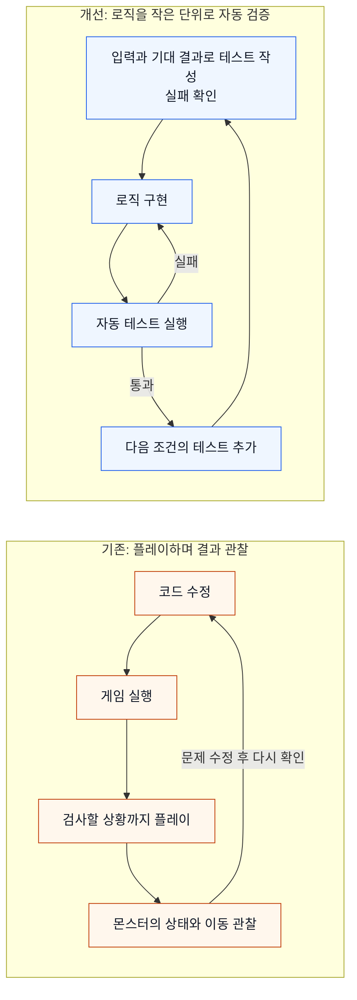
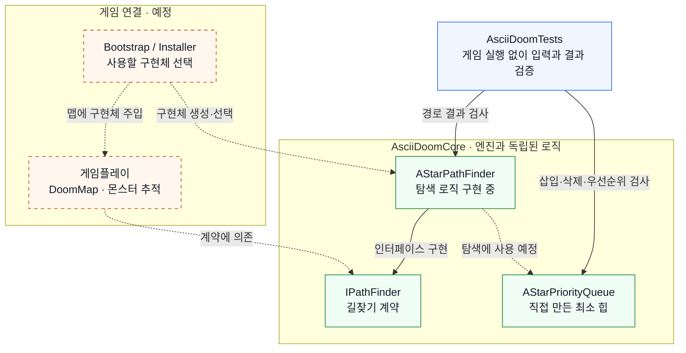

# ASCII Doom

HiwoongEngine의 3D ASCII 렌더러를 1인칭 게임에 적용하는 진행 중인 프로젝트입니다.


## 개발 과정

아래 자료는 각 기능을 추가하던 시점의 기록입니다. 최신 UI 결과는 위 화면을 기준으로 볼 수 있습니다.

### Step 1. 맵 렌더링과 플레이어 이동

https://github.com/user-attachments/assets/865c266e-8450-480e-a423-dcdda1b79d45

### Step 2. 손전등

https://github.com/user-attachments/assets/5a2b94c3-1b5d-4a2d-8865-a76ca032c596

### Step 3. 총과 조준점 표시

https://github.com/user-attachments/assets/ad7fd86f-5ee3-47ba-800e-8a30ebba1aff

### Step 4. 일시정지 메뉴

https://github.com/user-attachments/assets/472910dd-32d5-4a0f-b779-d556f6dc4e8c

### Step 5. 마우스 커서 숨기기

https://github.com/user-attachments/assets/da1e2ae7-e510-43eb-9f87-d4b80016d05d

### Step 6. HP·AMMO UI


### Step 7. 발사 애니메이션

https://github.com/user-attachments/assets/add28a26-4993-4756-ac9e-6a16d6e0a38a


### Step 8. 재장전 애니메이션

https://github.com/user-attachments/assets/4a433b47-2877-48de-bc82-da66d511ef53


### Step 9. 탄환 발사 및 피격 효과

https://github.com/user-attachments/assets/98f8e1cd-fc63-4a95-9056-60def4282a98


### Step 10. 적 테스트

https://github.com/user-attachments/assets/4320f76c-edb7-43d7-a17d-4f33a0b32d38


### Step 11. 길찾기 알고리즘

https://github.com/user-attachments/assets/e4fcf815-cd4e-40b7-b00a-c392d1a5de45


## 문제 해결 과정

### 1. 의존성 주입 및 TDD 테스트 적용

**문제**

몬스터를 제작한 뒤 플레이어를 추적하는 로직을 구현하려고 했습니다. 이전에는 게임을 실행하면 구현 결과를 바로 확인할 수 있어 테스트 과정이 크게 번거롭지 않았습니다. 하지만 프로젝트가 복잡해지면서, 추적 로직을 확인하려면 게임을 플레이하고 몬스터의 상태와 이동을 관찰해야 했습니다. 원하는 상황을 매번 재현해야 하므로 다양한 조건을 즉시 검증하기 어려워졌습니다.

또한 A* 알고리즘뿐 아니라 탐색에 사용할 우선순위 큐 같은 자료구조도 직접 구현하고자 했습니다. 이를 한꺼번에 게임에 연결하면 문제가 발생했을 때 자료구조, 경로 탐색, 몬스터 이동 중 어디에서 잘못됐는지 구분하기 어려웠습니다.

다음과 같이 검증 과정을 바꾸어, 게임에서 상황을 재현하기 전에 계산 로직부터 확인할 수 있게 했습니다.



**해결 접근**

이를 해결하기 위해 의존성 주입(DI)과 TDD를 도입했습니다. 몬스터의 추적 기능은 구체적인 A* 구현체 대신 길찾기 인터페이스에 의존하도록 설계했습니다. 게임플레이에서 `IPathFinder` 구현체를 사용하는 맵은 외부에서 구현체를 주입받고, 몬스터에는 이동에 필요한 경로를 제공하는 역할을 맡도록 계획했습니다. 길찾기 로직은 엔진에 의존하지 않는 `AsciiDoomCore`로 분리하고, `AsciiDoomTests`에서 게임을 실행하지 않고 입력과 결과를 직접 검증할 수 있게 했습니다.

테스트에서는 작은 격자와 시작점·목표점을 넣고 예상 경로를 확인합니다. 먼저 원하는 동작을 테스트로 작성해 실패를 확인한 뒤, 이를 통과하도록 구현을 추가하는 방식으로 진행했습니다. 직접 만든 우선순위 큐도 삽입 후 최소 비용 노드가 선택되는지, 제거 후 다음 노드가 올바르게 선택되는지 별도로 검사합니다. 이렇게 각 로직을 작은 단위로 검증한 뒤 조합하고, 마지막에 몬스터에 연결하는 흐름을 선택했습니다.

테스트에서는 구현체를 직접 만들어 검증하고, 게임에서는 인터페이스를 통해 사용할 수 있도록 구성합니다. 아래 그림은 맵과 몬스터를 게임플레이로 묶은 개념도입니다. **실선은 현재 구현된 관계**, **점선은 이후 연결할 관계**입니다.



**현재 적용 상태와 경험**

현재는 길찾기 인터페이스와 독립된 테스트 환경, 격자 데이터 및 직접 구현한 우선순위 큐를 마련했습니다. A*의 직선 경로와 우선순위 큐 동작을 검사하고 있으며, 벽을 우회하는 경로 탐색은 실패하는 테스트를 기준으로 구현을 진행 중입니다. 검증된 길찾기 구현체를 맵에 주입하고, 제공된 경로를 따라 몬스터가 이동하는지 확인하는 단계는 이후에 연결할 예정입니다.

이 방식은 이전 프로젝트에서도 사용해 온 개발 방식입니다. 복잡한 문제를 작은 로직으로 나누어 검증하고, 여러 테스트를 한 번에 반복 실행해 확인한 뒤 구현체를 연결하면, 게임에서 특정 상황을 매번 재현하는 부담을 줄일 수 있습니다.

관련 코드: [IPathFinder](../HiwoongEngine/AsciiDoomCore/PathFinder/Interfaces/IPathFinder.h), [PathNode 및 우선순위 큐](../HiwoongEngine/AsciiDoomCore/PathFinder/PathNode.cpp), [길찾기·우선순위 큐 테스트](../HiwoongEngine/AsciiDoomTests/PathFinder/AStarPathFinderTests.cpp)

## 객체와 컴포넌트의 역할

공통 엔진의 Scene·GameObject·Component 구조를 재사용합니다. 게임 객체가 필요한 기능을 조합하고, 표시·입력·상태 전달을 나누어 구성했습니다.

```text
DoomScene
├─ DoomMap                  텍스트 맵, 벽 메시, 스폰 위치
├─ Player                   이동, HP·AMMO 값
│  ├─ BoxCollider3DComponent
│  ├─ MouseLookComponent
│  ├─ PauseMenuComponent
│  ├─ Gun                   SpriteRendererComponent
│  └─ Crosshair             SpriteRendererComponent + CrossHairMoveComponent
└─ PlayerHUID               HUD 배치
   ├─ HPDisplay             HpDisplayComponent + BigTextDisplayComponent + SpriteRendererComponent
   └─ AmmoDisplay           AmmoDisplayComponent + BigTextDisplayComponent + SpriteRendererComponent
```

위 트리는 객체의 구성 관계를 나타냅니다. GameObject의 수명과 등록은 Scene이 관리하며, 부모·자식 관계는 Transform 연결과 함께 설정합니다. `PlayerHUID`는 현재 소스에 사용된 클래스 이름입니다.

| 책임 | 구현 위치 |
|---|---|
| 맵 완성 후 플레이어·카메라·HUD 연결 | [DoomScene.cpp](Scene/DoomScene.cpp) |


| 이동 입력과 이동 적용, HP·AMMO 상태 | [Player.cpp](Player/Player.cpp) |
| 수평 시점 회전 | [MouseLookComponent.cpp](../HiwoongEngine/src/Component/MouseLookComponent.cpp) |
| 총 표시 | [Gun.cpp](Player/Gun.cpp) |
| 조준점 세로 이동 | [CrossHairMoveComponent.cpp](Component/CrossHairMoveComponent.cpp) |
| HUD 객체 배치와 수치 표시 | [PlayerHUID.cpp](UI/PlayerHUID.cpp), [UI 폴더](UI) |

현재 이동과 HP·AMMO 값은 `Player`에 있습니다. 발사와 몬스터 행동을 추가할 때는 기존 컴포넌트를 재사용할 수 있는지 먼저 검토하고, 기능별 책임을 분리하는 방향으로 확장합니다.

## 텍스트 맵을 3D 공간으로 구성

[Level01.txt](Assets/Maps/Level01.txt)는 가로 10칸, 세로 6칸의 평면 맵입니다.

```text
##########
#P.......#
#.####...#
#....#..M#
#..M.....#
##########
```

| 문자 | 빌더가 수행하는 작업 |
|---|---|
| `#` | 벽 메시를 합치고 `BoxCollider3DComponent`가 있는 벽 객체 생성 |
| `.` | 빈 공간으로 처리 |
| `P` | 플레이어 시작 위치 저장 |
| `M` | 향후 몬스터 배치에 사용할 위치 저장 |

`DoomMap`은 파일을 읽고 타일 문자를 순회합니다. `TileBuilderRegistry`가 문자에 해당하는 `ITileBuilder`를 찾고, 각 빌더의 `Build(DoomMap&, const Vector3&)`가 타일별 작업을 수행합니다. 맵 읽기와 타일 생성 규칙을 분리한 팩토리 구조입니다.

벽은 공용 `MeshFactory::CreateCube(1.0f)`로 만듭니다. 각 벽의 정점을 하나의 맵 메시로 합치고, 이웃도 벽인 측면은 삼각형 목록에 넣지 않습니다. 벽 사이에 가려진 면의 렌더링을 줄이는 방식이며, 충돌체는 벽 객체마다 유지합니다.

맵 구성이 끝나면 `AddOnMapBuilt(...)`로 등록한 콜백을 실행합니다. `DoomScene`은 이 알림을 받은 뒤 플레이어를 저장된 시작점에 배치하고, 플레이어 Transform을 참조하는 카메라와 HUD를 생성합니다.

`M`은 현재 위치를 수집하는 표식입니다. 몬스터 인스턴스 생성이나 AI 실행으로 이어지는 코드는 아직 없습니다.

관련 코드: [DoomMap.cpp](Map/DoomMap.cpp), [TileBuilderRegistry.cpp](Map/TileBuilderRegistry.cpp), [WallTileBuilder.cpp](Map/BuildImplements/WallTileBuilder.cpp)

## 이동과 충돌

WASD 입력을 플레이어의 수평 회전 방향에 맞는 이동 벡터로 바꿉니다. 벡터를 정규화한 뒤 `deltaTime`을 곱해, 대각선 이동이 더 빨라지지 않도록 합니다.

이동 적용은 X축과 Z축으로 나누어 처리합니다. X축 이동 가능 여부를 먼저 확인하고, 그 결과 위치에서 Z축을 검사합니다. 한 축이 벽에 막혀도 다른 축으로는 움직일 수 있어 벽을 따라 미끄러집니다.

충돌은 `Scene::CanMoveTo(...)`를 통해 공용 `CollisionSystem`에 요청합니다. 플레이어와 벽의 축 정렬 상자 충돌체를 비교하며, 현재 이동 경로는 `DoomMap::CanMoveTo(...)`의 타일 검사 함수를 사용하지 않습니다.

관련 코드: [Player.cpp](Player/Player.cpp), [CollisionSystem.cpp](../HiwoongEngine/src/Physics/CollisionSystem.cpp), [BoxCollider3DComponent.cpp](../HiwoongEngine/src/Component/BoxCollider3DComponent.cpp)

## 3D 공간과 2D 화면의 결합

### 손전등과 ASCII 명암

`DoomScene`은 매 프레임 카메라의 View·Projection 행렬을 계산하고, 공용 `MeshRenderer`에 맵 메시를 전달합니다. 카메라 앞 경계면에서 삼각형을 자르는 Near Plane 클리핑과 깊이 버퍼도 공용 렌더러를 재사용합니다.

손전등의 위치는 플레이어, 방향은 카메라 정면을 따릅니다. 렌더러는 화면 셀에 대응하는 공간 위치를 원근 보정하여 복원하고, 빛과의 거리·각도·표면 방향으로 밝기를 계산합니다. 그 결과를 공백·`.`·`:`·`*`·`#`·`@` 중 하나로 바꿉니다.

현재 Doom의 기본 밝기는 `0.2`, 방향광 세기는 `0`입니다. 기본 밝기에 손전등을 더해 가까운 벽과 정면을 향한 표면을 구분합니다.

관련 코드: [DoomScene.cpp](Scene/DoomScene.cpp), [MeshRenderer.cpp](../HiwoongEngine/src/Render/MeshRenderer.cpp)

### 총·조준점과 HUD 영역

총과 조준점은 Player의 자식 GameObject이며, 기존 `SpriteRendererComponent`로 여러 줄의 문자를 출력합니다. 공백 구간은 렌더 명령에서 제외하므로 뒤의 맵을 가리지 않습니다. 출력 순서 값으로 총·조준점·HUD가 3D 맵 위에 보이게 합니다.

`DoomScene`은 원래 화면 크기를 `gameSize`로 보관하고, 전체 출력 높이에 HUD용 10행을 추가합니다. 3D 투영은 `gameSize`를 기준으로 계산하고, HUD는 그 아래에서 시작합니다. 문자 셀의 가로·세로 비율도 투영의 화면 비율에 반영합니다.

총의 로컬 위치는 게임 영역 하단을 기준으로 계산합니다. 조준점은 중앙에서 시작하며, `CrossHairMoveComponent`가 마우스 Y 이동량을 받아 로컬 Y를 `30~50`으로 제한합니다. 카메라의 상하 회전은 연결하지 않았습니다.

관련 코드: [Gun.cpp](Player/Gun.cpp), [CrossHair.cpp](Player/CrossHair.cpp), [SpriteRendererComponent.cpp](../HiwoongEngine/src/Component/SpriteRendererComponent.cpp)

### 값 변경에 반응하는 HUD

HP·AMMO 표시 컴포넌트는 시작할 때 현재 값을 표시하고, Player의 변경 콜백에 등록합니다. `SetHp(int)`와 `SetAmmo(int)`는 음수를 0으로 제한하며, 실제 값이 달라질 때만 콜백을 호출합니다.

`BigTextDisplayComponent`는 문자열을 5×5 문자 패턴으로 확장해 SpriteRenderer에 전달합니다. HUD 배치는 이 컴포넌트가 계산한 크기를 사용합니다. 콜백은 표시 컴포넌트를 `weak_ptr`로 참조해 UI의 수명을 불필요하게 연장하지 않습니다.

현재는 수치 변경과 화면 갱신 경로까지 구현되어 있습니다. HP 감소를 일으키는 피격이나 AMMO를 소비하는 발사는 아직 연결되지 않았습니다.

관련 코드: [HpDisplayComponent.cpp](UI/HpDisplayComponent.cpp), [AmmoDisplayComponent.cpp](UI/AmmoDisplayComponent.cpp), [BigTextDisplayComponent.cpp](UI/BigTextDisplayComponent.cpp)

## 상태를 유지하는 일시정지

`PauseMenuComponent`가 Esc 입력을 받아 `Engine::OpenPauseScene<MenuScene>()`을 호출합니다. 엔진은 진행 중인 게임 Scene을 `pausedScene`에 보관하고 MenuScene으로 전환합니다. 메뉴가 활성화된 동안 게임 Scene의 업데이트는 실행하지 않습니다.

메뉴 배경에는 전환 직전의 문자 프레임을 캡처해 사용합니다. 저장된 프레임의 밝기 속성을 낮추고 그 위에 메뉴를 그리므로, 멈춘 게임 화면을 유지하면서 선택 항목을 강조할 수 있습니다.

재개 시 `ResumeScene()`은 보관했던 같은 Scene으로 돌아갑니다. 맵과 플레이어를 다시 만들지 않아 위치·방향·상태가 유지됩니다. 메뉴 진입 시 마우스 잠금을 풀고, 재개 시 잠금과 이동량 기준을 초기화합니다.

관련 코드: [PauseMenuComponent.cpp](Component/PauseMenuComponent.cpp), [MenuScene.cpp](Scene/MenuScene.cpp), [Engine.h](../HiwoongEngine/src/Engine/Engine.h), [Renderer.cpp](../HiwoongEngine/src/Render/Renderer.cpp)

## 실행과 조작

공통 빌드 안내는 [루트 README](../README.md)를 참고하세요. [공유 솔루션](../HiwoongEngine/HiwoongEngine.sln)에서 `AsciiDoom` 프로젝트를 선택합니다.

현재 [Main.cpp](Main.cpp)는 `WindowRenderOutput(Vector2(4, 8))`을 엔진에 전달합니다. 렌더러가 만든 문자·색상 셀을 Win32 창에 출력하며, 게임 창을 마우스 입력 대상으로 연결합니다. 공용 엔진은 `IRenderOutput`으로 출력 구현을 교체할 수 있고, Doom의 실행 진입점은 창 출력을 선택합니다.

| 입력 | 동작 |
|---|---|
| `W` / `S` | 전진 / 후진 |
| `A` / `D` | 왼쪽 / 오른쪽 이동 |
| 마우스 좌우 | 수평 시점 회전 |
| 마우스 상하 | 조준점의 제한된 세로 이동 |
| 플레이 중 `Esc` | 일시정지 메뉴 열기 |
| 메뉴에서 `↑` / `↓` | RESUME / QUIT 선택 |
| 메뉴에서 `Enter` | 선택 실행 |
| 메뉴에서 `Esc` | 게임 재개 |


개발 범위는 현재 TXT 타일 방식의 단일 스테이지를 기준으로 합니다.
