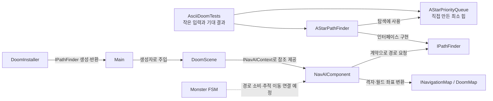
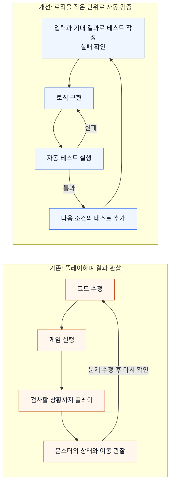
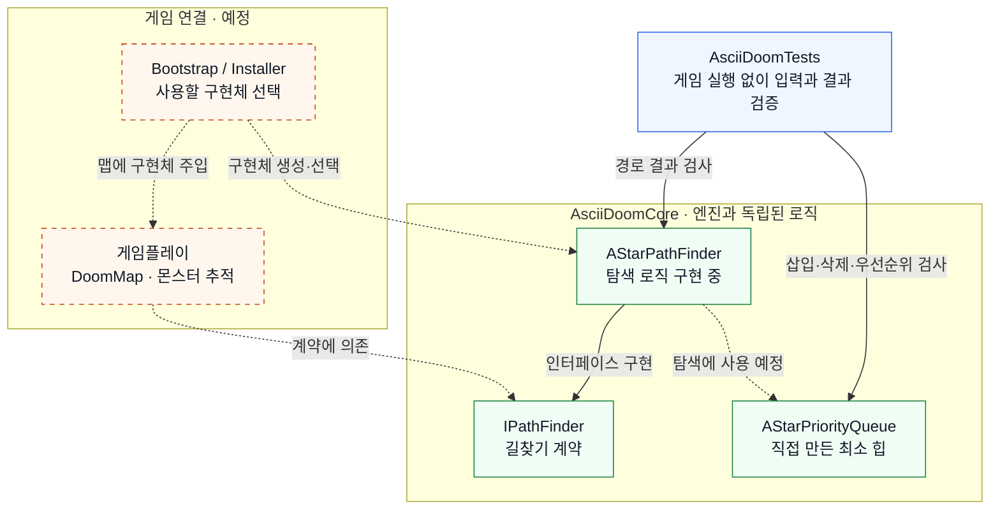

# ASCII Doom

**직접 제작한 C++ 게임 엔진 HiwoongEngine으로 3D 공간을 문자와 색상으로 표현하는 개발 중인 1인칭 게임입니다.**

CPU에서 정점 변환, 삼각형 래스터화, 깊이 판정과 조명을 계산하고, 그 결과를 ASCII 문자 셀로 출력합니다. 공통 엔진의 Scene·GameObject·Component 구조 위에 맵, 무기, HUD와 몬스터를 구성하며, 길찾기 로직은 엔진과 독립된 Core에서 테스트합니다.

목표는 작은 평면 맵 하나에서 총 한 종류와 몬스터 한 종류의 추적·전투를 완성하는 단일 스테이지 데모입니다.

**개발 시연:** [문자 셀별 색상](#step-13-픽셀-컬러-표시) · [길찾기](#step-11-길찾기-알고리즘) · [탄환과 피격 효과](#step-9-탄환-발사-및-피격-효과)

## 현재 구현과 개발 상태

문서 기준일: **2026-10-07**. 아래 영상은 각 개발 시점의 기록이며, 다음 표는 현재 소스에서 연결된 기능을 설명합니다.

| 분야 | 구현 내용 |
|---|---|
| 3D 렌더링 | 원근 투영, 근평면 클리핑, 뒷면 제거, 삼각형 래스터화, 깊이 버퍼, 손전등 명암 |
| 맵·이동 | TXT 타일 맵 구성, 벽 충돌체, WASD 이동, 벽을 따라 미끄러지는 이동 검사 |
| 무기 | 조준점 방향으로 탄환 발사, 발사·재장전 애니메이션, 탄약 소비와 재장전 |
| 충돌·피해 | 탄환의 발사자 충돌 제외, `IDamageable` 대상에 피해 전달, 충돌 효과 재생과 종료 후 제거 |
| HUD·메뉴 | HP·AMMO 변경 콜백에 따른 표시 갱신, 게임 상태를 보존하는 일시정지·재개 |
| 길찾기 | 직접 만든 최소 힙을 사용하는 대각선 A*, 벽 모서리 통과 방지, `NavAIComponent`의 월드 좌표 경로 반환 |
| 몬스터 | 맵의 `M` 위치에서 생성, 충돌체와 HP, 거리 기반 FSM 상태 판단, 탄환에 의한 피해 처리 |

진행 중인 작업은 다음과 같습니다.

- **추적·전투 연결:** A* 경로 반환은 구현되어 있으나, 현재 Monster에 경로를 따라 이동하는 처리는 연결되지 않았습니다. 몬스터 공격의 플레이어 피해, 죽음 연출, 승리·패배 흐름도 미완료입니다.
- **관절형 3D 몬스터:** 외형과 Idle·Move를 별도 시제품에서 검증했습니다. 시제품은 보관된 상태이며 현재 게임 코드에는 아직 통합하지 않았습니다. 작업 브랜치에서는 기존 몬스터 스프라이트를 정리하고 3D 전환을 준비하고 있습니다.
- **FBX·Mixamo 연동 준비:** `ModelVertex`, `ModelTriangle`, `ModelMesh`, `ModelData` 중간 데이터 구조를 정의했습니다. 실제 FBX 읽기, 관절·가중치·클립 변환과 인게임 재생은 이후 작업입니다.

## 실행과 조작

공통 빌드 환경은 [루트 README](../README.md)를 참고하세요. Visual Studio에서 [공유 솔루션](../HiwoongEngine/HiwoongEngine.sln)을 열고 `AsciiDoom`을 시작 프로젝트로 선택해 빌드·실행합니다. 길찾기 단위 테스트는 같은 솔루션의 `AsciiDoomTests` 프로젝트에서 실행합니다.

[Main.cpp](Main.cpp)는 `WindowRenderOutput(Vector2(4, 8))`을 선택합니다. 계산한 문자·색상 셀은 Win32 창에 출력하고, 해당 창을 마우스 입력 대상으로 사용합니다. 공통 엔진은 `IRenderOutput`으로 출력 구현을 교체할 수 있습니다.

| 입력 | 동작 |
|---|---|
| `W` / `S` | 전진 / 후진 |
| `A` / `D` | 왼쪽 / 오른쪽 이동 |
| 마우스 좌우 | 수평 시점 회전 |
| 마우스 상하 | 조준점의 제한된 세로 이동 |
| 마우스 왼쪽 클릭 | 사격. 탄약이 없으면 재장전 요청 |
| `R` | 재장전 |
| 플레이 중 `Esc` | 일시정지 메뉴 열기 |
| 메뉴에서 `↑` / `↓` | RESUME / QUIT 선택 |
| 메뉴에서 `Enter` | 선택 실행 |
| 메뉴에서 `Esc` | 게임 재개 |

카메라의 상하 회전은 연결하지 않았습니다.

## 핵심 구현

### 공통 3D 렌더링과 ASCII 명암

`DoomScene`은 카메라의 View·Projection과 광원 정보를 구성하고, `IRenderable3D`를 구현한 컴포넌트를 공용 `MeshRenderer`에 전달합니다. 각 컴포넌트는 메시, 모델 행렬, 문자·색상 선택을 제공하며, 투영·클리핑·깊이 계산은 같은 렌더러를 사용합니다.

```text
정점의 Model·View 변환
    → 근평면 클리핑
    → 원근 투영
    → 화면 셀별 깊이·UV·공간 위치 계산
    → 깊이 판정과 조명 계산
    → 문자·색상 셀 출력
```

손전등의 위치는 플레이어, 방향은 카메라 정면을 따릅니다. 렌더러는 화면 셀에 대응하는 공간 위치를 원근 보정하여 복원하고, 빛과의 거리·각도·표면 방향으로 밝기를 계산합니다. 메시 표면은 이 밝기를 [ShaderData](../HiwoongEngine/src/Render/ShaderData.h)의 10단계 문자표로 변환합니다.

현재 기본 밝기는 `0.2`, 방향광 세기는 `0`이며, 손전등을 더해 표면의 명암을 표현합니다. `SpriteFrame`은 셀마다 문자와 색상을 저장합니다. 3D 스프라이트는 UV로 해당 셀을 선택해 저장된 문자·색상을 반환하며, 현재 스프라이트 색상 자체는 광원 밝기에 따라 변하지 않습니다.

관련 코드: [DoomScene](Scene/DoomScene.cpp), [IRenderable3D](../HiwoongEngine/src/Render/IRenderable3D.h), [MeshRenderer](../HiwoongEngine/src/Render/MeshRenderer.cpp), [SpriteRenderer3DComponent](../HiwoongEngine/src/Component/SpriteRenderer3DComponent.cpp)

### 텍스트 맵과 이동·충돌

[Level01.txt](Assets/Maps/Level01.txt)의 문자를 타일 생성 규칙과 연결합니다.

| 문자 | 처리 |
|---|---|
| `#` | 벽 메시와 충돌체 생성 |
| `.` | 빈 공간 |
| `P` | 플레이어 시작 위치 저장 |
| `M` | 몬스터 시작 위치 저장 |

`DoomMap`은 파일을 읽고, `TileBuilderRegistry`가 문자에 해당하는 `ITileBuilder`를 선택합니다. 벽은 공용 큐브 메시로 구성하되 이웃 벽에 가려지는 측면은 삼각형 목록에서 제외합니다. 벽 충돌체는 각 객체에 유지합니다.

맵 완성 콜백을 받은 `DoomScene`은 플레이어·카메라·HUD를 준비하고, 모든 `M` 위치에 몬스터를 생성합니다.

플레이어 이동은 방향을 정규화하고 `deltaTime`을 반영합니다. 이동 예정 위치를 X축과 Z축으로 나누어 `Scene::CanMoveTo()`에 검사하므로, 한 축이 벽에 막혀도 다른 축으로 이동할 수 있습니다. 실제 충돌 검사는 공통 `CollisionSystem`과 AABB Collider가 담당합니다.

관련 코드: [DoomMap](Map/DoomMap.cpp), [TileBuilderRegistry](Map/TileBuilderRegistry.cpp), [WallTileBuilder](Map/BuildImplements/WallTileBuilder.cpp), [Player](Player/Player.cpp), [CollisionSystem](../HiwoongEngine/src/Physics/CollisionSystem.cpp)

### 무기·충돌 효과·HUD

`Gun`은 발사 애니메이션이 시작되면 조준점 방향으로 `Bullet`을 생성하고 탄약을 한 발 소비합니다. 재장전 애니메이션이 끝나면 탄약을 최대치로 채웁니다.

`Bullet`은 발사자와의 충돌을 제외하고, 상대가 `IDamageable`을 구현했다면 피해를 전달합니다. 충돌 시 별도의 `EffectViewObject`를 생성하고 탄환은 제거합니다. 효과 객체는 자신의 애니메이션 종료 알림을 받아 제거됩니다.

HP·AMMO 표시 컴포넌트는 Player의 값 변경 콜백을 구독합니다. `BigTextDisplayComponent`가 문자열을 5×5 문자 패턴으로 확장해 표시하며, 값이 실제로 바뀔 때 HUD를 갱신합니다. `Player::TakeDamage()`에서 HP 표시로 이어지는 경로는 있으나, 몬스터 공격이 이 기능을 호출하는 연결은 아직 없습니다.

게임 영역 아래에 HUD 영역을 두고, 총·조준점은 화면 좌표와 출력 순서로 배치합니다. 문자 셀의 가로·세로 비율은 3D 투영의 화면 비율에도 반영합니다.

관련 코드: [Gun](Player/Gun.cpp), [Bullet](GameObject/Bullet.cpp), [EffectViewObject](GameObject/EffectViewObject.cpp), [IDamageable](Interfaces/IDamageable.h), [HUD](UI)

### 상태를 보존하는 일시정지

`PauseMenuComponent`가 Esc 입력을 받아 엔진에 메뉴 Scene 전환을 요청합니다. 엔진은 게임 Scene을 보관하고 업데이트를 멈추며, 직전 문자 프레임을 어둡게 표시한 메뉴를 엽니다. 재개 시 같은 Scene으로 돌아가 위치·방향·상태를 유지하고 마우스 잠금을 복구합니다.

관련 코드: [PauseMenuComponent](Component/PauseMenuComponent.cpp), [MenuScene](Scene/MenuScene.cpp), [Engine](../HiwoongEngine/src/Engine/Engine.h)

## 문제 해결 과정

### 1. 의존성 주입 및 TDD 테스트 적용

**문제**

초기에는 게임을 실행하면 변경한 결과를 바로 볼 수 있었습니다. 몬스터 추적을 구현하는 단계에서는 원하는 위치와 벽 배치를 재현하고 이동을 관찰해야 했으므로, 여러 조건을 빠르게 반복 검증하기 어려워졌습니다. A*와 우선순위 큐를 동시에 게임에 붙이면 오류가 자료구조, 탐색, 이동 중 어디에서 발생했는지도 구분하기 어려웠습니다.

**선택한 방법**

길찾기를 엔진에 의존하지 않는 `AsciiDoomCore`로 분리하고, 게임은 `IPathFinder` 계약에 의존하도록 구성했습니다. `DoomInstaller`가 구체 구현체를 만들고 Main에서 `DoomScene`에 전달하는 수동 의존성 주입을 사용합니다.

테스트에서는 작은 격자와 시작점·목표점으로 원하는 동작을 먼저 정의하고, 실패를 확인한 뒤 구현을 추가하는 TDD 방식으로 진행했습니다. 직접 만든 최소 힙도 삽입 후 최소 비용 노드 선택과 제거 후 힙 복원을 별도로 검증하도록 구성했습니다. 기존 프로젝트에서 사용하던 의존성 분리와 테스트 방식을 직접 만든 C++ 엔진에도 적용한 것입니다.


```mermaid
flowchart LR
    T["AsciiDoomTests<br/>작은 입력과 기대 결과"] --> A["AStarPathFinder"]
    T --> Q["AStarPriorityQueue<br/>직접 만든 최소 힙"]
    A -->|"탐색에 사용"| Q
    A -->|"인터페이스 구현"| I["IPathFinder"]
    D["DoomInstaller"] -->|"IPathFinder 생성·반환"| M["Main"]
    M -->|"생성자로 주입"| S["DoomScene"]
    S -->|"INavAIContext로 참조 제공"| N["NavAIComponent"]
    N -->|"계약으로 경로 요청"| I
    N -->|"격자·월드 좌표 변환"| MAP["INavigationMap / DoomMap"]
    MON["Monster FSM"] -.->|"경로 소비·추적 이동 연결 예정"| N
```

실선은 구현된 연결이며, 점선은 미완료인 몬스터 추적 이동 연결입니다. `NavAIComponent`는 경로를 반환하고, 완성 시 이동·공격 판단은 Monster의 FSM이 담당합니다. 현재 Monster에는 거리 기반 상태 판단만 연결되어 있습니다.

**결과**

게임을 실행하지 않고 직선·벽 우회·도달 불가·잘못된 좌표와 우선순위 큐 동작을 확인할 수 있는 테스트 작업대를 만들었습니다. A*는 직선 비용 10, 대각선 비용 14를 사용하고, 대각선의 두 옆칸 중 하나라도 벽이면 후보를 제외합니다. 알고리즘과 게임 이동을 나누어 검증할 수 있으며, 테스트가 있는 경로 탐색과 실제 몬스터 이동의 완성 상태도 구분합니다.

관련 코드: [IPathFinder](../HiwoongEngine/AsciiDoomCore/PathFinder/Interfaces/IPathFinder.h), [AStarPathFinder](../HiwoongEngine/AsciiDoomCore/PathFinder/Implements/AStarPathFinder.cpp), [PathNode·우선순위 큐](../HiwoongEngine/AsciiDoomCore/PathFinder/PathNode.cpp), [단위 테스트](../HiwoongEngine/AsciiDoomTests/PathFinder/AStarPathFinderTests.cpp), [DoomInstaller](Bootstrap/DoomInstaller.cpp), [NavAIComponent](Component/NavAIComponent.cpp)

### 2. 메시와 3D 스프라이트의 렌더링 통일

3D 스프라이트를 추가하면서 투영·클리핑·깊이 처리를 별도로 구현하면 같은 렌더링 계산이 두 곳으로 나뉘는 문제가 생깁니다. `IRenderable3D`를 통해 각 컴포넌트가 자신의 메시와 표면 정보를 제공하고 공통 렌더러가 출력하도록 구성했습니다.

근평면에서 삼각형을 자를 때 정점 위치와 UV를 함께 보간해, 잘린 경계에서도 원래 스프라이트의 문자 셀을 선택할 수 있게 했습니다. 깊이 처리와 광원 계산은 공통으로 유지하고, 메시와 스프라이트의 문자·색상 선택만 각 구현체가 담당합니다.

## 객체와 컴포넌트의 역할

GameObject의 생성·수명은 Scene이 관리합니다. 객체가 생성한 다른 객체와 Transform의 부모·자식 관계는 별개이며, 아래 목록은 기능 구성과 생성 관계를 설명합니다.

| 담당 | 책임·주요 컴포넌트 |
|---|---|
| [DoomScene](Scene/DoomScene.cpp) | 맵 완성 후 객체 생성, 카메라·렌더 뷰, 내비게이션 참조 제공 |
| [DoomMap](Map/DoomMap.cpp) | 텍스트 맵, 벽 메시, 스폰 위치, 내비게이션 격자와 좌표 변환 |
| [Player](Player/Player.cpp) | 이동·HP·AMMO, Collider·MouseLook·PauseMenu, Gun·Crosshair 생성과 참조 연결 |
| [Gun](Player/Gun.cpp) | SpriteRenderer·SpriteAnimation, 탄환 생성·탄약 소비·재장전 |
| [Bullet](GameObject/Bullet.cpp) | MeshRender·Collider, 이동·수명, 충돌 피해와 효과 생성 |
| [EffectViewObject](GameObject/EffectViewObject.cpp) | SpriteRenderer3D·SpriteAnimation, 충돌 연출과 종료 후 제거 |
| [Monster](GameObject/Monster.cpp) | Collider·NavAI, HP와 FSM. 3D 전환 작업에서 기존 스프라이트 표현을 정리한 상태 |
| [NavAIComponent](Component/NavAIComponent.cpp) | IPathFinder·INavigationMap 참조, 시작·목적지로 월드 좌표 경로 반환 |
| [PlayerHUID](UI/PlayerHUID.cpp)·[UI](UI) | HPDisplay·AmmoDisplay 배치, 값 변경 구독과 큰 문자 표시 |

`PlayerHUID`는 현재 소스의 클래스 이름입니다. HPDisplay·AmmoDisplay는 HUD에 Transform 부모를 연결하지만, Gun·Crosshair는 Player가 생성하고 참조를 연결하는 Scene 객체입니다.

## 개발 과정

아래 자료는 각 기능을 추가하던 시점의 시연입니다. 몬스터 관련 영상에는 이전 2D 스프라이트 구현이 포함되어 있으며, 현재 3D 전환 작업의 결과를 의미하지 않습니다.

### Step 1. 맵 렌더링과 플레이어 이동

https://github.com/user-attachments/assets/865c266e-8450-480e-a423-dcdda1b79d45

### Step 2. 손전등

https://github.com/user-attachments/assets/5a2b94c3-1b5d-4a2d-8865-a76ca032c596

### Step 3. 총과 조준점 표시

https://github.com/user-attachments/assets/ad7fd86f-5ee3-47ba-800e-8a30ebba1aff

### Step 4. 일시정지 메뉴

https://github.com/user-attachments/assets/472910dd-32d5-4a0f-b779-d556f6dc4e8c

### Step 5. 마우스 커서 숨기기

https://github.com/user-attachments/assets/da1e2ae7-e510-43eb-9f87-d4b80016d05d

### Step 6. HP·AMMO UI


### Step 7. 발사 애니메이션

https://github.com/user-attachments/assets/add28a26-4993-4756-ac9e-6a16d6e0a38a


### Step 8. 재장전 애니메이션

https://github.com/user-attachments/assets/4a433b47-2877-48de-bc82-da66d511ef53


### Step 9. 탄환 발사 및 피격 효과

https://github.com/user-attachments/assets/98f8e1cd-fc63-4a95-9056-60def4282a98


### Step 10. 적 테스트

https://github.com/user-attachments/assets/4320f76c-edb7-43d7-a17d-4f33a0b32d38


### Step 11. 길찾기 알고리즘

https://github.com/user-attachments/assets/e4fcf815-cd4e-40b7-b00a-c392d1a5de45


### Step 12. 애니메이션 상태변경


https://github.com/user-attachments/assets/5fe08a5e-9f18-4f6a-a9cd-0fca11ac458e

### Step 13. 픽셀 컬러 표시

https://github.com/user-attachments/assets/b942b436-fb5e-4eb5-ae30-a69bb85c9eeb
<<<<<<< Updated upstream


### Step 14. 몬스터의 2D 스프라이트 렌더러 -> 3D 메쉬 렌더러 방식 변경


## 문제 해결 과정

### 1. 의존성 주입 및 TDD 테스트 적용

**문제**

몬스터를 제작한 뒤 플레이어를 추적하는 로직을 구현하려고 했습니다만, 이전에는 게임을 실행하면 구현 결과를 바로 확인할 수 있어 테스트 과정이 크게 번거롭지 않았습니다. 하지만 프로젝트가 복잡해지면서, 추적 로직을 확인하려면 게임을 플레이하고 몬스터의 상태와 이동을 관찰해야 했습니다. 원하는 상황을 매번 재현해야 하므로 다양한 조건을 즉시 검증하기 어려워졌습니다.

또한 A* 알고리즘뿐 아니라 탐색에 유리한 자료구조도 직접 구현하고자 하였기에 이를 한꺼번에 게임에 연결하면 문제가 발생했을 때 자료구조, 경로 탐색, 몬스터 이동 중 어디에서 잘못됐는지 구분하기 어려웠습니다. 

그래서 단계적으로 로직을 분리하고 테스트 결과를 확인하기 위해.
DI 프레임 워크와 TDD를 이용했습니다.

게임엔진 라이프 사이클을 밟지않고 테스트를 통해 결과를 확인할 수 있게 했습니다.


```mermaid
flowchart LR
    subgraph BEFORE["기존: 플레이하며 결과 관찰"]
        direction TB
        B1["코드 수정"] --> B2["게임 실행"]
        B2 --> B3["검사할 상황까지 플레이"]
        B3 --> B4["몬스터의 상태와 이동 관찰"]
        B4 -->|"문제 수정 후 다시 확인"| B1
    end

    subgraph AFTER["개선: 로직을 작은 단위로 자동 검증"]
        direction TB
        A1["입력과 기대 결과로 테스트 작성<br/>실패 확인"] --> A2["로직 구현"]
        A2 --> A3["자동 테스트 실행"]
        A3 -->|"실패"| A2
        A3 -->|"통과"| A4["다음 조건의 테스트 추가"]
        A4 --> A1
    end

    classDef manual fill:#fff7ed,stroke:#c2410c,color:#111827
    classDef automated fill:#eff6ff,stroke:#2563eb,color:#111827
    class B1,B2,B3,B4 manual
    class A1,A2,A3,A4 automated
```

**해결 접근**

이를 해결하기 위해 의존성 주입(DI)과 TDD를 도입했습니다. 몬스터의 추적 기능은 구체적인 A* 구현체 대신 길찾기 인터페이스에 의존하도록 설계했습니다. 게임플레이에서 `IPathFinder` 구현체를 사용하는 맵은 외부에서 구현체를 주입받고, 몬스터에는 이동에 필요한 경로를 제공하는 역할을 맡도록 계획했습니다. 길찾기 로직은 엔진에 의존하지 않는 `AsciiDoomCore`로 분리하고, `AsciiDoomTests`에서 게임을 실행하지 않고 입력과 결과를 직접 검증할 수 있게 했습니다.

테스트에서는 작은 격자와 시작점·목표점을 넣고 예상 경로를 확인합니다. 먼저 원하는 동작을 테스트로 작성해 실패를 확인한 뒤, 이를 통과하도록 구현을 추가하는 방식으로 진행했습니다. 직접 만든 우선순위 큐도 삽입 후 최소 비용 노드가 선택되는지, 제거 후 다음 노드가 올바르게 선택되는지 별도로 검사합니다. 이렇게 각 로직을 작은 단위로 검증한 뒤 조합하고, 마지막에 몬스터에 연결하는 흐름을 선택했습니다.

테스트에서는 구현체를 직접 만들어 검증하고, 게임에서는 인터페이스를 통해 사용할 수 있도록 구성합니다. 아래 그림은 맵과 몬스터를 게임플레이로 묶은 개념도입니다. **실선은 현재 구현된 관계**, **점선은 이후 연결할 관계**입니다.


```mermaid
flowchart TB
    TEST["AsciiDoomTests<br/>게임 실행 없이 입력과 결과 검증"]

    subgraph CORE["AsciiDoomCore · 엔진과 독립된 로직"]
        CONTRACT["IPathFinder<br/>길찾기 계약"]
        ASTAR["AStarPathFinder<br/>탐색 로직 구현 중"]
        QUEUE["AStarPriorityQueue<br/>직접 만든 최소 힙"]
        ASTAR -->|"인터페이스 구현"| CONTRACT
        ASTAR -.->|"탐색에 사용 예정"| QUEUE
    end

    TEST -->|"경로 결과 검사"| ASTAR
    TEST -->|"삽입·삭제·우선순위 검사"| QUEUE

    subgraph GAME["게임 연결 · 예정"]
        INSTALLER["Bootstrap / Installer<br/>사용할 구현체 선택"]
        GAMEPLAY["게임플레이<br/>DoomMap · 몬스터 추적"]
        INSTALLER -.->|"맵에 구현체 주입"| GAMEPLAY
    end

    INSTALLER -.->|"구현체 생성·선택"| ASTAR
    GAMEPLAY -.->|"계약에 의존"| CONTRACT

    classDef tests fill:#eff6ff,stroke:#2563eb,color:#111827
    classDef core fill:#f0fdf4,stroke:#15803d,color:#111827
    classDef planned fill:#fff7ed,stroke:#c2410c,color:#111827,stroke-dasharray:5 5
    class TEST tests
    class CONTRACT,ASTAR,QUEUE core
    class INSTALLER,GAMEPLAY planned
```


관련 코드: [IPathFinder](../HiwoongEngine/AsciiDoomCore/PathFinder/Interfaces/IPathFinder.h), [PathNode 및 우선순위 큐](../HiwoongEngine/AsciiDoomCore/PathFinder/PathNode.cpp), [길찾기·우선순위 큐 테스트](../HiwoongEngine/AsciiDoomTests/PathFinder/AStarPathFinderTests.cpp)

## 객체와 컴포넌트의 역할

공통 엔진의 Scene·GameObject·Component 구조를 재사용합니다. 게임 객체가 필요한 기능을 조합하고, 표시·입력·상태 전달을 나누어 구성했습니다.

```text
DoomScene
├─ DoomMap                  텍스트 맵, 벽 메시, 스폰 위치
├─ Player                   이동, HP·AMMO 값
│  ├─ BoxCollider3DComponent
│  ├─ MouseLookComponent
│  ├─ PauseMenuComponent
│  ├─ Gun                   SpriteRendererComponent
│  └─ Crosshair             SpriteRendererComponent + CrossHairMoveComponent
└─ PlayerHUID               HUD 배치
   ├─ HPDisplay             HpDisplayComponent + BigTextDisplayComponent + SpriteRendererComponent
   └─ AmmoDisplay           AmmoDisplayComponent + BigTextDisplayComponent + SpriteRendererComponent
```

위 트리는 객체의 구성 관계를 나타냅니다. GameObject의 수명과 등록은 Scene이 관리하며, 부모·자식 관계는 Transform 연결과 함께 설정합니다. `PlayerHUID`는 현재 소스에 사용된 클래스 이름입니다.

| 책임 | 구현 위치 |
|---|---|
| 맵 완성 후 플레이어·카메라·HUD 연결 | [DoomScene.cpp](Scene/DoomScene.cpp) |


| 이동 입력과 이동 적용, HP·AMMO 상태 | [Player.cpp](Player/Player.cpp) |
| 수평 시점 회전 | [MouseLookComponent.cpp](../HiwoongEngine/src/Component/MouseLookComponent.cpp) |
| 총 표시 | [Gun.cpp](Player/Gun.cpp) |
| 조준점 세로 이동 | [CrossHairMoveComponent.cpp](Component/CrossHairMoveComponent.cpp) |
| HUD 객체 배치와 수치 표시 | [PlayerHUID.cpp](UI/PlayerHUID.cpp), [UI 폴더](UI) |

현재 이동과 HP·AMMO 값은 `Player`에 있습니다. 발사와 몬스터 행동을 추가할 때는 기존 컴포넌트를 재사용할 수 있는지 먼저 검토하고, 기능별 책임을 분리하는 방향으로 확장합니다.

## 텍스트 맵을 3D 공간으로 구성

[Level01.txt](Assets/Maps/Level01.txt)는 가로 10칸, 세로 6칸의 평면 맵입니다.

```text
##########
#P.......#
#.####...#
#....#..M#
#..M.....#
##########
```

| 문자 | 빌더가 수행하는 작업 |
|---|---|
| `#` | 벽 메시를 합치고 `BoxCollider3DComponent`가 있는 벽 객체 생성 |
| `.` | 빈 공간으로 처리 |
| `P` | 플레이어 시작 위치 저장 |
| `M` | 향후 몬스터 배치에 사용할 위치 저장 |

`DoomMap`은 파일을 읽고 타일 문자를 순회합니다. `TileBuilderRegistry`가 문자에 해당하는 `ITileBuilder`를 찾고, 각 빌더의 `Build(DoomMap&, const Vector3&)`가 타일별 작업을 수행합니다. 맵 읽기와 타일 생성 규칙을 분리한 팩토리 구조입니다.

벽은 공용 `MeshFactory::CreateCube(1.0f)`로 만듭니다. 각 벽의 정점을 하나의 맵 메시로 합치고, 이웃도 벽인 측면은 삼각형 목록에 넣지 않습니다. 벽 사이에 가려진 면의 렌더링을 줄이는 방식이며, 충돌체는 벽 객체마다 유지합니다.

맵 구성이 끝나면 `AddOnMapBuilt(...)`로 등록한 콜백을 실행합니다. `DoomScene`은 이 알림을 받은 뒤 플레이어를 저장된 시작점에 배치하고, 플레이어 Transform을 참조하는 카메라와 HUD를 생성합니다.

`M`은 현재 위치를 수집하는 표식입니다. 몬스터 인스턴스 생성이나 AI 실행으로 이어지는 코드는 아직 없습니다.

관련 코드: [DoomMap.cpp](Map/DoomMap.cpp), [TileBuilderRegistry.cpp](Map/TileBuilderRegistry.cpp), [WallTileBuilder.cpp](Map/BuildImplements/WallTileBuilder.cpp)

## 이동과 충돌

WASD 입력을 플레이어의 수평 회전 방향에 맞는 이동 벡터로 바꿉니다. 벡터를 정규화한 뒤 `deltaTime`을 곱해, 대각선 이동이 더 빨라지지 않도록 합니다.

이동 적용은 X축과 Z축으로 나누어 처리합니다. X축 이동 가능 여부를 먼저 확인하고, 그 결과 위치에서 Z축을 검사합니다. 한 축이 벽에 막혀도 다른 축으로는 움직일 수 있어 벽을 따라 미끄러집니다.

충돌은 `Scene::CanMoveTo(...)`를 통해 공용 `CollisionSystem`에 요청합니다. 플레이어와 벽의 축 정렬 상자 충돌체를 비교하며, 현재 이동 경로는 `DoomMap::CanMoveTo(...)`의 타일 검사 함수를 사용하지 않습니다.

관련 코드: [Player.cpp](Player/Player.cpp), [CollisionSystem.cpp](../HiwoongEngine/src/Physics/CollisionSystem.cpp), [BoxCollider3DComponent.cpp](../HiwoongEngine/src/Component/BoxCollider3DComponent.cpp)

## 3D 공간과 2D 화면의 결합

### 손전등과 ASCII 명암

`DoomScene`은 매 프레임 카메라의 View·Projection 행렬을 계산하고, 공용 `MeshRenderer`에 맵 메시를 전달합니다. 카메라 앞 경계면에서 삼각형을 자르는 Near Plane 클리핑과 깊이 버퍼도 공용 렌더러를 재사용합니다.

손전등의 위치는 플레이어, 방향은 카메라 정면을 따릅니다. 렌더러는 화면 셀에 대응하는 공간 위치를 원근 보정하여 복원하고, 빛과의 거리·각도·표면 방향으로 밝기를 계산합니다. 그 결과를 공백·`.`·`:`·`*`·`#`·`@` 중 하나로 바꿉니다.

현재 Doom의 기본 밝기는 `0.2`, 방향광 세기는 `0`입니다. 기본 밝기에 손전등을 더해 가까운 벽과 정면을 향한 표면을 구분합니다.

관련 코드: [DoomScene.cpp](Scene/DoomScene.cpp), [MeshRenderer.cpp](../HiwoongEngine/src/Render/MeshRenderer.cpp)

### 총·조준점과 HUD 영역

총과 조준점은 Player의 자식 GameObject이며, 기존 `SpriteRendererComponent`로 여러 줄의 문자를 출력합니다. 공백 구간은 렌더 명령에서 제외하므로 뒤의 맵을 가리지 않습니다. 출력 순서 값으로 총·조준점·HUD가 3D 맵 위에 보이게 합니다.

`DoomScene`은 원래 화면 크기를 `gameSize`로 보관하고, 전체 출력 높이에 HUD용 10행을 추가합니다. 3D 투영은 `gameSize`를 기준으로 계산하고, HUD는 그 아래에서 시작합니다. 문자 셀의 가로·세로 비율도 투영의 화면 비율에 반영합니다.

총의 로컬 위치는 게임 영역 하단을 기준으로 계산합니다. 조준점은 중앙에서 시작하며, `CrossHairMoveComponent`가 마우스 Y 이동량을 받아 로컬 Y를 `30~50`으로 제한합니다. 카메라의 상하 회전은 연결하지 않았습니다.

관련 코드: [Gun.cpp](Player/Gun.cpp), [CrossHair.cpp](Player/CrossHair.cpp), [SpriteRendererComponent.cpp](../HiwoongEngine/src/Component/SpriteRendererComponent.cpp)

### 값 변경에 반응하는 HUD

HP·AMMO 표시 컴포넌트는 시작할 때 현재 값을 표시하고, Player의 변경 콜백에 등록합니다. `SetHp(int)`와 `SetAmmo(int)`는 음수를 0으로 제한하며, 실제 값이 달라질 때만 콜백을 호출합니다.

`BigTextDisplayComponent`는 문자열을 5×5 문자 패턴으로 확장해 SpriteRenderer에 전달합니다. HUD 배치는 이 컴포넌트가 계산한 크기를 사용합니다. 콜백은 표시 컴포넌트를 `weak_ptr`로 참조해 UI의 수명을 불필요하게 연장하지 않습니다.

현재는 수치 변경과 화면 갱신 경로까지 구현되어 있습니다. HP 감소를 일으키는 피격이나 AMMO를 소비하는 발사는 아직 연결되지 않았습니다.

관련 코드: [HpDisplayComponent.cpp](UI/HpDisplayComponent.cpp), [AmmoDisplayComponent.cpp](UI/AmmoDisplayComponent.cpp), [BigTextDisplayComponent.cpp](UI/BigTextDisplayComponent.cpp)

## 상태를 유지하는 일시정지

`PauseMenuComponent`가 Esc 입력을 받아 `Engine::OpenPauseScene<MenuScene>()`을 호출합니다. 엔진은 진행 중인 게임 Scene을 `pausedScene`에 보관하고 MenuScene으로 전환합니다. 메뉴가 활성화된 동안 게임 Scene의 업데이트는 실행하지 않습니다.

메뉴 배경에는 전환 직전의 문자 프레임을 캡처해 사용합니다. 저장된 프레임의 밝기 속성을 낮추고 그 위에 메뉴를 그리므로, 멈춘 게임 화면을 유지하면서 선택 항목을 강조할 수 있습니다.

재개 시 `ResumeScene()`은 보관했던 같은 Scene으로 돌아갑니다. 맵과 플레이어를 다시 만들지 않아 위치·방향·상태가 유지됩니다. 메뉴 진입 시 마우스 잠금을 풀고, 재개 시 잠금과 이동량 기준을 초기화합니다.

관련 코드: [PauseMenuComponent.cpp](Component/PauseMenuComponent.cpp), [MenuScene.cpp](Scene/MenuScene.cpp), [Engine.h](../HiwoongEngine/src/Engine/Engine.h), [Renderer.cpp](../HiwoongEngine/src/Render/Renderer.cpp)

## 실행과 조작

공통 빌드 안내는 [루트 README](../README.md)를 참고하세요. [공유 솔루션](../HiwoongEngine/HiwoongEngine.sln)에서 `AsciiDoom` 프로젝트를 선택합니다.

현재 [Main.cpp](Main.cpp)는 `WindowRenderOutput(Vector2(4, 8))`을 엔진에 전달합니다. 렌더러가 만든 문자·색상 셀을 Win32 창에 출력하며, 게임 창을 마우스 입력 대상으로 연결합니다. 공용 엔진은 `IRenderOutput`으로 출력 구현을 교체할 수 있고, Doom의 실행 진입점은 창 출력을 선택합니다.

| 입력 | 동작 |
|---|---|
| `W` / `S` | 전진 / 후진 |
| `A` / `D` | 왼쪽 / 오른쪽 이동 |
| 마우스 좌우 | 수평 시점 회전 |
| 마우스 상하 | 조준점의 제한된 세로 이동 |
| 플레이 중 `Esc` | 일시정지 메뉴 열기 |
| 메뉴에서 `↑` / `↓` | RESUME / QUIT 선택 |
| 메뉴에서 `Enter` | 선택 실행 |
| 메뉴에서 `Esc` | 게임 재개 |


개발 범위는 현재 TXT 타일 방식의 단일 스테이지를 기준으로 합니다.
=======
>>>>>>> Stashed changes
