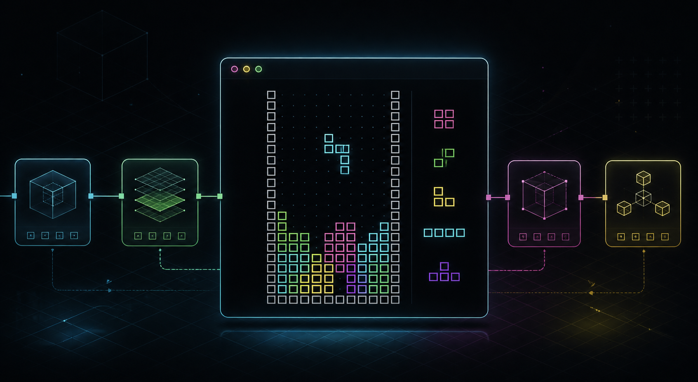
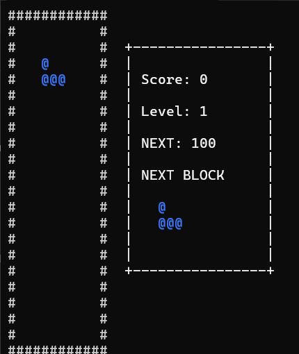

<div align="center">

# HiwoongEngine

### 작은 콘솔 게임 엔진을 직접 만들고, 그 위에서 테트리스를 완성해 가는 프로젝트




<sub>엔진 구조와 테트리스를 함께 표현한 콘셉트 이미지입니다.</sub>

</div>

## 이 프로젝트는 무엇인가요?

HiwoongEngine은 **게임을 바로 만드는 대신, 게임을 만들 수 있는 작은 엔진부터 직접 구현해 본 프로젝트**입니다.

먼저 화면 출력, 키보드 입력, 장면 전환, 게임 오브젝트의 생명주기 같은 기반 기능을 만들었습니다. 그다음 `GameObject`에 필요한 기능을 부품처럼 붙이는 **컴포넌트 시스템**을 추가했습니다. 마지막으로 이 기능들을 실제로 사용할 수 있는지 확인하기 위해 콘솔 테트리스를 만들었습니다.

```text
1. 작은 게임 엔진 제작
          ↓
2. 컴포넌트 시스템 추가
          ↓
3. 엔진의 기능을 조합해 테트리스 제작
```

게임 개발을 전공하지 않은 사람도 구조를 따라갈 수 있도록, 어려운 용어보다 “누가 무엇을 관리하는가”를 중심으로 설명합니다.

---

## 현재 실행 화면

<div align="center">



</div>

왼쪽은 실제 플레이 영역입니다. 오른쪽 UI에는 현재 점수, 레벨, 다음 레벨에 필요한 점수, 다음에 등장할 블록을 표시합니다.

## 조작 방법

| 키 | 동작 |
|---|---|
| `←` / `→` | 블록을 좌우로 이동 |
| `↓` | 블록을 한 칸 빠르게 내리기 |
| `↑` | 블록을 시계 방향으로 회전 |
| `Space` | 블록을 바닥까지 즉시 내리고 고정 |
| `Esc` | 게임 종료 |
| 게임오버 화면에서 `R` | 게임 화면으로 다시 진입 *(점수·레벨 초기화는 작업 예정)* |

---

## 게임 엔진을 쉽게 이해하기

게임 엔진을 하나의 **공연장**으로 생각하면 구조가 쉬워집니다.

| 엔진 개념 | 공연장에 비유하면 | 이 프로젝트에서 하는 일 |
|---|---|---|
| `Engine` | 공연장 전체를 운영하는 관리자 | 게임 루프, 입력, 화면, Scene 전환 관리 |
| `Scene` | 하나의 무대 | 현재 화면에 존재하는 GameObject 관리 |
| `GameObject` | 무대 위 배우 | 벽, 블록, UI처럼 게임에 존재하는 대상 |
| `Component` | 배우에게 주는 역할과 장비 | 위치, 그림, 입력 같은 기능을 조립 |
| `Renderer` | 관객에게 무대를 보여주는 조명·화면 | 문자, 위치, 색상을 콘솔에 출력 |


### 누가 누구를 소유하나요?

위쪽 객체가 아래쪽 객체의 수명을 책임집니다.

```text
Engine
  └─ Scene
      └─ GameObject
          └─ Component
```

- 소유하는 방향에는 주로 `shared_ptr` 또는 `unique_ptr`를 사용합니다.
- 아래 객체가 자신의 주인을 조회할 때는 `weak_ptr`를 사용합니다.
- 이 방식은 서로가 서로를 계속 소유해 메모리가 해제되지 않는 **순환 참조**를 막아 줍니다.

---

## 한 프레임은 어떻게 움직이나요?

게임은 정지 화면을 매우 빠르게 반복해서 보여 줍니다. 그 한 번의 반복을 **프레임**이라고 합니다.


1. 키보드 상태를 읽습니다.
2. 새 Scene이 있다면 초기화합니다.
3. 새 GameObject와 Component의 `Start()`를 한 번 호출합니다.
4. `Update()`에서 이동과 게임 규칙을 계산합니다.
5. `Draw()`에서 화면에 그릴 명령을 모읍니다.
6. 요청된 Scene이 있다면 안전한 시점에 교체합니다.
7. 프레임 도중 예약된 생성과 삭제를 마지막에 처리합니다.

생성과 삭제를 즉시 처리하지 않고 예약하는 이유는, 목록을 순회하는 도중 목록 자체가 바뀌어 발생할 수 있는 오류를 피하기 위해서입니다.

---

## 컴포넌트 시스템

`GameObject`가 몸체라면 `Component`는 몸체에 꽂는 기능 부품입니다.


테트리스 조각 하나는 부모 `TetrisModule`과 자식 `Block` 네 개로 구성됩니다.

- 모든 `GameObject`에는 위치를 담당하는 `TransformComponent`가 기본으로 만들어집니다.
- 부모 `TetrisModule`에는 `PlayerInputComponent`를 붙여 이동·회전·즉시 낙하 입력을 처리합니다.
- 자식 `Block` 네 개에는 각각 `SpriteRendererComponent`를 붙여 `@` 문자와 색상을 출력합니다.

`GameObject`는 자신에게 붙은 컴포넌트에 `Start()`, `Update()`, `Draw()`를 전달합니다. 덕분에 입력과 화면 출력의 책임을 분리하면서도, 부모가 움직이면 네 자식 블록이 함께 움직이게 만들 수 있습니다.

<details>
<summary><strong>직접 만든 런타임 타입 확인 기능</strong></summary>

컴포넌트를 `GetComponent<T>()`로 찾기 위해 간단한 RTTI(Runtime Type Information, 실행 중 타입 확인) 시스템을 구현했습니다. 각 타입이 가진 고유 ID를 비교하고, 부모 타입까지 이어서 확인합니다.

관련 파일: `HiwoongEngine/HiwoongEngine/Core/HiwoongObject.h`

</details>

---

## 문자 기반 렌더링

이 프로젝트는 OpenGL이나 DirectX 대신 Windows 콘솔 API로 화면을 그립니다.

```text
SpriteRendererComponent
        ↓
Renderer에 문자 · 위치 · 색상 제출
        ↓
RenderQueue에서 그리기 순서 정리
        ↓
2차원 화면 데이터를 CHAR_INFO 배열에 기록
        ↓
두 개의 콘솔 버퍼를 번갈아 화면에 표시
```

두 개의 화면 버퍼를 번갈아 사용하는 방식을 **더블 버퍼링**이라고 합니다. 한 화면을 보여 주는 동안 다음 화면을 준비하기 때문에 깜빡임을 줄일 수 있습니다.

현재 렌더러가 지원하는 기능:

- 문자열과 ASCII 문자 출력
- Windows 콘솔 색상
- 좌표 기반 배치
- Sorting Order를 이용한 겹침 순서
- Scene 크기에 맞춘 콘솔 화면 크기 변경
- 두 개의 `ScreenBuffer`를 이용한 더블 버퍼링

---

## 엔진으로 만든 테트리스


### 구현된 기능

- I, O, T, L, J, S, Z 일곱 종류의 블록
- 블록별 색상과 피벗 기준 90도 회전
- 좌우 이동, 한 칸 하강, 즉시 낙하
- 벽과 이미 고정된 블록의 충돌 검사
- 블록 고정과 다음 블록 자동 생성
- 완성된 줄 삭제와 위쪽 블록 내리기
- 한 줄을 지울 때마다 10점 추가
- 점수 조건에 따른 레벨 상승과 낙하 속도 증가
- 다음 블록 예약과 UI 미리보기
- 새 블록을 놓을 공간이 없을 때 GameOver Scene 전환
- 텍스트 파일로 불러오는 맵과 GAME OVER ASCII 아트

### 테트리스 보드는 어떻게 충돌을 확인하나요?

테트리스 보드는 화면의 `(x, y)` 좌표를 하나의 배열 번호로 바꿉니다.

```cpp
index = y * width + x;
```

각 칸이 비었는지 확인해 블록이 이동할 수 있는지 판단합니다. 블록이 고정되면 해당 칸에 블록의 약한 참조(`weak_ptr`)도 함께 저장합니다. 그래서 줄을 지울 때 어떤 블록을 삭제하고 아래로 옮겨야 하는지 찾을 수 있습니다.

### 레벨과 UI 데이터는 왜 Scene 밖에 있나요?

Scene은 레벨이 바뀌면 파괴됩니다. 하지만 점수와 현재 레벨은 다음 Scene에서도 유지되어야 합니다. 그래서 `TetrisGameState`라는 별도 상태 객체가 데이터를 보관하고, 새 UI는 그 값을 다시 읽어 표시합니다.

```text
기존 TestScene과 UI 파괴
          ↓
TetrisGameState의 점수와 레벨은 유지
          ↓
새 TestScene과 UI가 같은 데이터를 읽음
```

---

## 프로젝트 구조

```text
HiwoongEngine/
├─ HiwoongEngine/          # DLL로 빌드되는 엔진 소스
│  ├─ Component/           # Transform, SpriteRenderer, BoxCollider
│  ├─ Core/                # 입력, 기본 객체, 타입 시스템
│  ├─ Engine/              # 게임 루프
│  ├─ GameObject/          # GameObject 생명주기와 부모·자식 구조
│  ├─ Render/              # RenderQueue, Frame, ScreenBuffer
│  └─ Scene/               # Scene과 GameObject 관리
├─ TetrisProject/          # 엔진을 사용하는 콘솔 테트리스
│  ├─ GameObject/          # 블록, 보드, 입력, 스폰 매니저
│  ├─ Interface/           # 공통 테트리스 모듈 규칙
│  ├─ Manager/             # 점수·레벨·다음 블록 상태
│  └─ Scene/               # 게임, UI, 게임오버 Scene
├─ Assets/Stages/          # 맵과 GAME OVER 텍스트 파일
├─ Config/Setting.txt      # 목표 FPS와 기본 콘솔 크기
├─ Includes/               # 엔진 빌드 시 복사되는 공개 헤더
└─ Library/                # 엔진 빌드 결과인 LIB/DLL
```

---

## 빌드하고 실행하기

### 필요한 환경

- Windows 10 또는 Windows 11
- Visual Studio 2022
- Visual Studio Installer의 **Desktop development with C++** 워크로드
- Windows 10 SDK와 MSVC v143 도구 모음
- x64 환경

별도의 외부 라이브러리는 사용하지 않습니다. C++ 표준 라이브러리와 Windows API만 사용합니다.

### Visual Studio에서 실행

1. 저장소를 내려받습니다.

   ```powershell
   git clone https://github.com/heewoung-lee/HiwoongEngine.git
   cd HiwoongEngine
   ```

2. `HiwoongEngine/HiwoongEngine.sln`을 Visual Studio로 엽니다.
3. 상단 구성을 `Debug`와 `x64`로 선택합니다.
4. 솔루션 탐색기에서 **HiwoongEngine 프로젝트를 먼저 빌드**합니다.
5. `TetrisProject`를 시작 프로젝트로 설정합니다.
6. `Ctrl + F5`를 눌러 실행합니다.

엔진 프로젝트를 먼저 빌드하면 필요한 헤더, DLL, LIB 파일이 `Includes`와 `Library`로 복사됩니다. 이후 TetrisProject가 그 결과물을 링크합니다.

### 명령줄에서 실행할 때

빌드된 실행 파일은 에셋을 상대경로로 읽습니다. 따라서 프로젝트 폴더를 작업 디렉터리로 사용해야 합니다.

```powershell
cd HiwoongEngine\TetrisProject
& ..\Bin\Debug\TetrisProject\TetrisProject.exe
```

---

## 자주 만나는 문제

### `HiwoongEngine.lib`를 찾을 수 없습니다

엔진 프로젝트가 아직 빌드되지 않았거나 TetrisProject와 다른 구성으로 빌드된 경우입니다. 두 프로젝트를 모두 `Debug / x64` 또는 모두 `Release / x64`로 맞추고 HiwoongEngine을 먼저 빌드하세요.

### `file.is_open()`에서 프로그램이 멈춥니다

실행 위치가 달라 `Config` 또는 `Assets` 파일을 찾지 못한 경우입니다. Visual Studio에서 실행하거나, 위의 명령처럼 `HiwoongEngine/TetrisProject`에서 실행하세요.

### `ScreenBuffer`의 assert에서 멈춥니다

현재 콘솔 창과 글꼴이 요청한 화면 크기를 지원하지 못할 수 있습니다. 콘솔 창을 넓히거나 `HiwoongEngine/Config/Setting.txt`의 기본 크기를 줄여 보세요.

---

## 현재 범위와 다음 목표

이 프로젝트는 학습을 위해 직접 만든 Windows 콘솔 엔진입니다. 상용 게임 엔진이나 표준 테트리스 규칙 전체를 목표로 하지는 않습니다.

- 렌더러는 Windows 콘솔 API에 의존하므로 현재는 Windows 전용입니다.
- 회전은 단순 피벗 회전이며 SRS와 Wall Kick은 아직 없습니다.
- 물리·AABB 충돌 코드는 실험 단계이며, 테트리스는 별도의 Board 셀 충돌을 사용합니다.
- 레벨이 오르면 같은 맵에서 낙하 속도가 증가합니다. 서로 다른 맵의 여러 스테이지는 아직 없습니다.
- 게임오버 후 재시도 시 게임 상태를 완전히 초기화하는 작업이 남아 있습니다.
- 자동화된 테스트 프로젝트는 아직 추가하지 않았습니다.

앞으로 충돌 시스템 정리, 테스트 코드, 스테이지 확장, 콘솔 렌더러 개선을 이어갈 계획입니다.

---

## 이 프로젝트에서 공부한 것

- C++ 객체의 값, 참조, 포인터 차이
- `unique_ptr`, `shared_ptr`, `weak_ptr`를 이용한 소유권 설계
- Scene과 GameObject의 생명주기
- 컴포넌트 기반 설계
- 부모·자식 Transform과 로컬·월드 좌표
- 2차원 좌표를 1차원 배열로 관리하는 방법
- 콜백을 이용한 블록 Lock 이벤트
- 콘솔 더블 버퍼링과 렌더 큐
- 엔진과 실제 게임 프로젝트를 DLL로 분리하는 방법

이 저장소의 핵심 목표는 “기능을 많이 넣는 것”보다 **게임 엔진의 구조를 직접 만들고, 실제 게임으로 검증하며 이해하는 것**입니다.

---

## 라이선스

현재 별도의 라이선스를 지정하지 않았습니다. 저장소가 공개되어 있더라도 코드의 복제·수정·배포 권한이 자동으로 부여되는 것은 아닙니다. 공개적인 재사용을 허용하려면 추후 라이선스 파일을 추가할 예정입니다.
