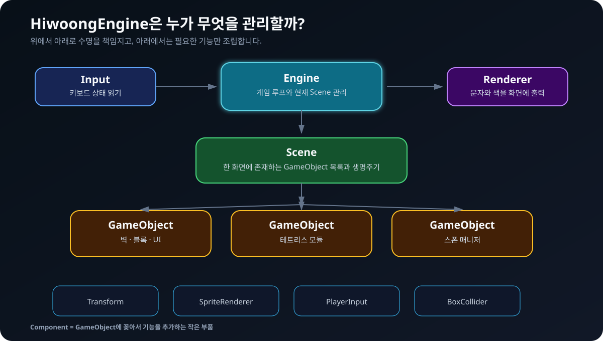
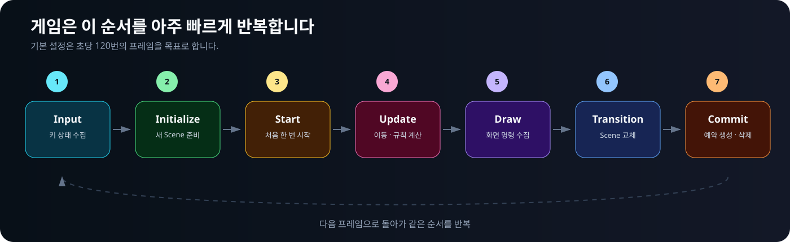
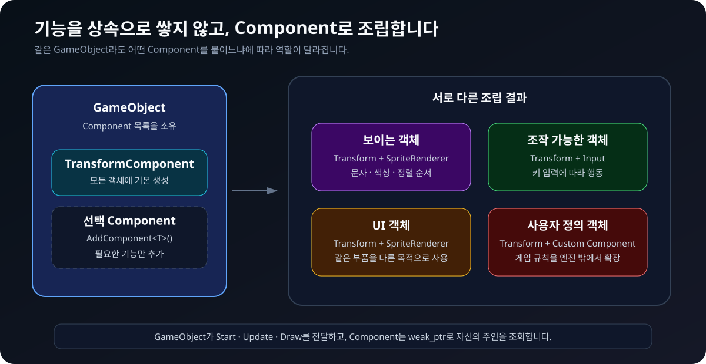
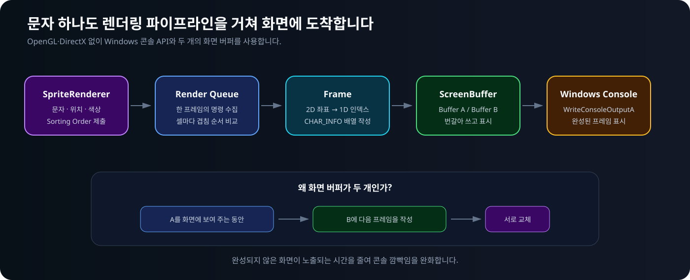
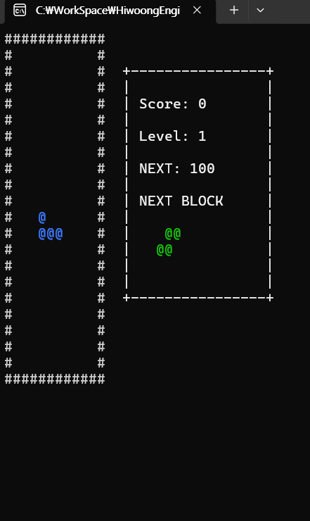
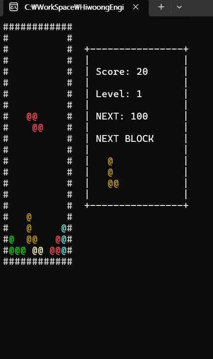
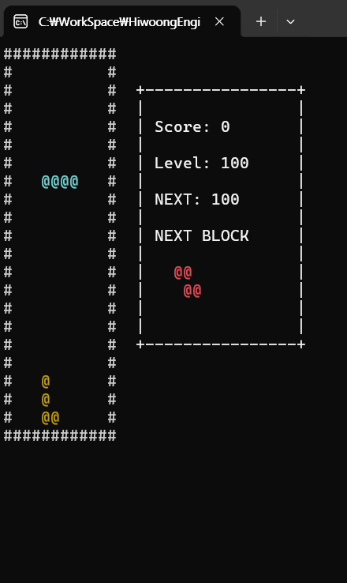
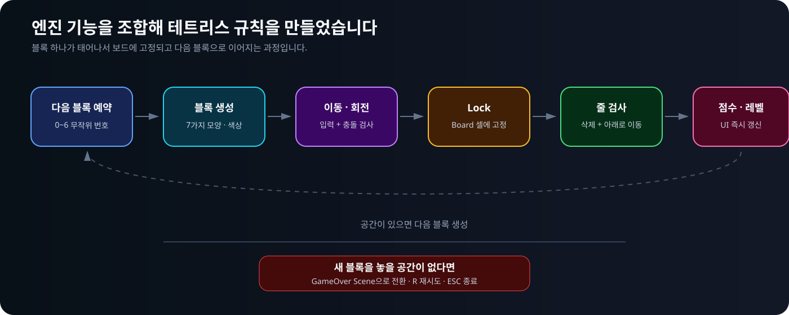
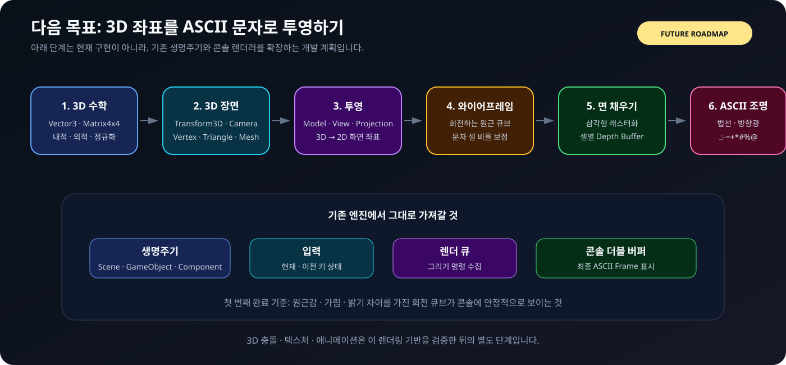

<div align="center">

# HiwoongEngine

### C++로 직접 구현한 Windows 콘솔 게임 엔진


**게임을 먼저 만든 프로젝트가 아니라, 게임을 실행할 수 있는 구조를 직접 구현한 프로젝트입니다.**

테트리스는 이 엔진의 입력, 생명주기, 컴포넌트, 렌더링, Scene 전환이 실제 게임에서도 작동하는지 검증하기 위해 만든 응용 예제입니다.

</div>



## 무엇을 직접 만들었나요?

HiwoongEngine은 OpenGL, DirectX 같은 그래픽 API나 외부 게임 프레임워크 없이 C++ 표준 라이브러리와 Windows 콘솔 API로 동작합니다.

| 영역 | 직접 구현한 내용 |
|---|---|
| 게임 루프 | 입력 → 초기화 → 시작 → 업데이트 → 그리기의 프레임 순서 |
| Scene | 현재 Scene과 다음 Scene의 안전한 교체, GameObject 관리 |
| GameObject | 생명주기, 부모·자식 관계, Component 보관 |
| Component | `AddComponent<T>()`, `GetComponent<T>()`, 주인 객체 조회 |
| Transform | 로컬 좌표와 부모 기준 월드 좌표 계산 |
| Input | 현재·이전 키 상태를 비교한 `GetKey`, `GetKeyDown`, `GetKeyUP` |
| Renderer | 문자·색상·좌표·겹침 순서 처리, 콘솔 더블 버퍼링 |
| Type System | Component 검색에 사용하는 간단한 자체 RTTI와 상속 타입 확인 |

---

## 1. 엔진의 소유 구조

비전공자도 쉽게 보면, `Engine`은 전체 프로그램을 운영하고 `Scene`은 현재 무대, `GameObject`는 무대 위 대상, `Component`는 대상에 붙이는 기능 부품입니다.

```text
Engine
  ├─ Input
  ├─ Renderer
  └─ Scene
      └─ GameObject
          └─ Component
```

- `Engine`은 `Input`과 `Renderer`를 하나씩 소유합니다.
- `Scene`은 자신에게 존재하는 여러 `GameObject`를 소유합니다.
- `GameObject`는 기본 `TransformComponent`와 추가 Component들을 소유합니다.
- 자식이 부모를 조회할 때는 `weak_ptr`를 사용해 순환 소유를 막습니다.

즉, **위에서 아래로 수명을 책임지고 아래에서는 필요한 부모를 약하게 조회하는 구조**입니다.

---

## 2. 한 프레임의 동작

게임은 아래 순서를 빠르게 반복합니다.



1. 키보드의 현재 상태를 읽습니다.
2. 새 Scene이라면 `SceneInitialize()`를 실행합니다.
3. 새 GameObject와 Component의 `Start()`를 한 번 실행합니다.
4. `Update()`에서 위치와 게임 규칙을 계산합니다.
5. `Draw()`에서 이번 프레임의 그리기 명령을 수집하고 출력합니다.
6. 요청된 다음 Scene이 있다면 현재 Scene과 교체합니다.
7. 예약된 GameObject·Component의 추가와 삭제를 반영합니다.

생성과 삭제를 즉시 처리하지 않고 프레임 끝에 반영하는 이유는, 목록을 순회하는 도중 컨테이너가 바뀌어 반복자가 무효화되는 문제를 피하기 위해서입니다.

---

## 3. 컴포넌트 기반 구조

하나의 거대한 상속 계층에 모든 기능을 넣지 않고, 필요한 기능을 Component로 붙입니다.



모든 `GameObject`에는 `TransformComponent`가 기본으로 만들어집니다. 화면에 보여야 한다면 `SpriteRendererComponent`, 입력을 받아야 한다면 사용자 입력 Component를 추가하는 식입니다.

```cpp
auto renderer = AddComponent<SpriteRendererComponent>();
auto input = AddComponent<PlayerInputComponent>();
```

`GameObject`는 `Start()`, `Update()`, `Draw()`를 자신에게 붙은 Component에 전달합니다. 그래서 기능은 분리되어 있지만 하나의 객체처럼 같은 생명주기로 움직입니다.

### 부모·자식 Transform

GameObject끼리 부모·자식 관계를 맺으면 자식은 자신의 로컬 좌표에 부모의 월드 좌표를 더합니다.

```text
자식 월드 좌표 = 부모 월드 좌표 + 자식 로컬 좌표
```

부모 하나를 움직였을 때 여러 자식이 함께 이동하는 복합 객체를 만들 수 있습니다.

<details>
<summary><strong>GetComponent&lt;T&gt;는 타입을 어떻게 찾나요?</strong></summary>

`HiwoongObject`에 간단한 런타임 타입 확인 기능을 구현했습니다. 타입마다 프로세스 안에서 구분되는 ID를 만들고 부모 타입을 연결해, 정확히 같은 타입뿐 아니라 상속 관계도 확인합니다. 이 ID는 저장 파일용 영구 ID가 아니라 실행 중 타입 비교용입니다.

관련 코드: `HiwoongEngine/HiwoongEngine/Core/HiwoongObject.h`

</details>

---

## 4. 문자가 화면에 그려지는 과정

`SpriteRendererComponent`가 바로 콘솔을 수정하지는 않습니다. Renderer에 명령을 제출하고, 하나의 완성된 Frame을 만든 뒤 화면 버퍼에 기록합니다.



1. `SpriteRendererComponent`가 문자열, 월드 좌표, 색상, `sortingOrder`를 제출합니다.
2. `Renderer`가 한 프레임의 `RenderCommand`를 모읍니다.
3. 각 화면 셀에서 기존 값과 `sortingOrder`를 비교해 앞에 보일 문자를 정합니다.
4. 2차원 좌표를 1차원 인덱스로 바꾸어 `CHAR_INFO` Frame을 작성합니다.
5. 두 개의 Win32 `ScreenBuffer`를 번갈아 활성화합니다.

한 버퍼를 화면에 보여 주는 동안 다른 버퍼에 다음 프레임을 준비하기 때문에 콘솔의 깜빡임을 줄일 수 있습니다. Scene 크기가 바뀌면 Renderer와 두 ScreenBuffer, Frame도 새 크기에 맞게 다시 구성됩니다.

---

## 5. 입력과 Scene 전환

### 입력

`Input`은 256개 가상 키의 현재 프레임과 이전 프레임 상태를 함께 저장합니다.

| 함수 | 의미 |
|---|---|
| `GetKey(key)` | 지금 키가 눌려 있는가? |
| `GetKeyDown(key)` | 이번 프레임에 처음 눌렸는가? |
| `GetKeyUP(key)` | 이번 프레임에 놓였는가? |

### Scene 전환

게임 도중 새 Scene을 요청하면 즉시 현재 Scene을 파괴하지 않습니다. `nextScene`에 보관했다가 프레임의 정해진 전환 지점에서 교체합니다. 덕분에 `Update()` 도중 객체와 Scene의 수명이 갑자기 끝나는 상황을 피합니다.

---

## 6. 현재 엔진의 범위

| 상태 | 기능 |
|---|---|
| 구현됨 | 게임 루프, Scene 전환, 예약 생성·삭제, 컴포넌트, Transform 계층, 키 입력 |
| 구현됨 | RenderCommand, 셀별 겹침 순서, CHAR_INFO Frame, 콘솔 더블 버퍼, 화면 크기 변경 |
| 실험 단계 | `BoxColliderComponent`, `CollisionSystem` — 아직 엔진 루프에 완전히 연결하지 않음 |
| 앞으로 구현 | 3D 수학, Camera, Mesh, 투영, 깊이 버퍼, 범용 물리·충돌 |

테트리스의 충돌은 실험 중인 `CollisionSystem`이 아니라, 게임 규칙에 맞춘 별도의 보드 셀 검사로 구현했습니다.

---

## 엔진 적용 사례: 콘솔 테트리스

테트리스 자체보다 **엔진의 구조가 실제 게임을 지탱할 수 있는지 검증하는 것**이 목적입니다.

<table>
  <tr>
    <td align="center"><br><sub>이동 · 회전 · 다음 블록 UI</sub></td>
    <td align="center"><br><sub>보드 점유 검사와 GameOver 전환</sub></td>
    <td align="center"><br><sub>상태 유지와 레벨별 낙하 속도</sub></td>
  </tr>
</table>



### 테트리스는 어떤 논리로 만들었나요?

1. `SpawnManager`가 다음 조각 종류를 예약하고 7가지 `TetrisModule` 중 하나를 생성합니다.
2. 하나의 `TetrisModule`은 자식 `Block` 네 개를 소유하며, 각 Block은 자신의 로컬 좌표에 그려집니다.
3. 이동과 회전 전에 네 Block의 다음 월드 좌표가 비어 있는지 `TetrisBoard`에 확인합니다.
4. 더 내려갈 수 없으면 Block을 보드 셀에 고정하고 완성된 줄을 찾습니다.
5. 줄을 지운 뒤 위쪽 Block을 아래로 이동하고 점수와 레벨 상태를 갱신합니다.
6. 공간이 있으면 다음 조각을 만들고, 스폰 위치가 막혀 있으면 GameOver Scene으로 전환합니다.

보드는 `(x, y)`를 `y * width + x`로 바꾼 1차원 배열을 사용합니다. `TetrisGameState`는 Scene이 교체되어도 유지해야 하는 점수, 레벨, 다음 조각 정보를 보관합니다.

<details>
<summary><strong>조작 방법</strong></summary>

| 키 | 동작 |
|---|---|
| `←` / `→` | 좌우 이동 |
| `↓` | 한 칸 빠르게 내리기 |
| `↑` | 시계 방향 회전 |
| `Space` | 즉시 낙하하고 고정 |
| `Esc` | 종료 |
| GameOver에서 `R` | 게임 Scene으로 다시 진입 |

</details>

---

## 다음 목표: 3D ASCII 렌더링

> 아래 내용은 **현재 구현된 기능이 아니라 향후 개발 계획**입니다.

테트리스로 2D 생명주기와 컴포넌트 구조를 검증한 다음, 같은 구조 위에 3D 좌표를 ASCII 문자로 투영하는 렌더링 파이프라인을 만들 계획입니다.



개발 순서는 다음과 같습니다.

1. `Vector3`, `Vector4`, `Matrix4x4`와 3D 벡터 연산
2. 위치·회전·크기를 가진 `Transform3D`, `Camera`, `Vertex`, `Triangle`, `Mesh`
3. Model → View → Projection 변환과 3D 좌표의 화면 투영
4. 콘솔 문자 셀 비율을 보정한 회전 와이어프레임 큐브
5. 삼각형 래스터화와 셀별 깊이 버퍼
6. 면의 밝기를 ` .:-=+*#%@` 같은 ASCII 농도와 색상으로 변환

첫 번째 3D 완료 기준은 **원근감, 가림, 밝기 차이를 가진 회전 큐브가 콘솔에 안정적으로 표시되는 것**입니다. 3D 충돌, 텍스처, 애니메이션은 이 기반을 검증한 뒤의 별도 단계로 둡니다.

---

## 프로젝트 구조

```text
HiwoongEngine/
├─ HiwoongEngine/          # DLL로 빌드되는 엔진 소스
│  ├─ Component/           # Component, Transform, SpriteRenderer
│  ├─ Core/                # 입력, 기본 객체, 자체 타입 시스템
│  ├─ Engine/              # 게임 루프와 Scene 전환
│  ├─ GameObject/          # 객체 생명주기와 부모·자식 구조
│  ├─ Render/              # RenderCommand, Frame, ScreenBuffer
│  └─ Scene/               # Scene과 예약 생성·삭제
├─ TetrisProject/          # 엔진을 사용하는 검증용 게임
├─ Assets/Stages/          # 맵과 GAME OVER ASCII 아트
├─ Config/Setting.txt      # 목표 FPS와 기본 콘솔 크기
├─ Includes/               # 엔진 공개 헤더 출력 위치
└─ Library/                # 빌드된 LIB/DLL 출력 위치
```

---

## 빌드하고 실행하기

### 필요한 환경

- Windows 10 또는 Windows 11
- Visual Studio 2022 이상
- **Desktop development with C++** 워크로드
- Windows SDK와 MSVC v143 도구 모음
- x64 빌드 구성

별도의 외부 라이브러리는 필요하지 않습니다.

### Visual Studio

1. 저장소를 내려받습니다.

   ```powershell
   git clone https://github.com/heewoung-lee/HiwoongEngine.git
   cd HiwoongEngine
   ```

2. `HiwoongEngine/HiwoongEngine.sln`을 엽니다.
3. 구성을 `Debug / x64`로 선택합니다.
4. **HiwoongEngine 프로젝트를 먼저 빌드**합니다.
5. `TetrisProject`를 시작 프로젝트로 설정합니다.
6. `Ctrl + F5`로 실행합니다.

엔진을 먼저 빌드하면 TetrisProject가 링크할 LIB와 실행에 필요한 DLL이 준비됩니다.

### 명령줄에서 실행

에셋을 상대경로로 읽으므로 `TetrisProject` 폴더를 작업 디렉터리로 사용합니다.

```powershell
cd HiwoongEngine\TetrisProject
& ..\Bin\Debug\TetrisProject\TetrisProject.exe
```

---

## 현재 제약

- Windows 콘솔 API에 의존하므로 Windows 전용입니다.
- 그래픽 카드가 아니라 CPU에서 문자 Frame을 만듭니다.
- 범용 충돌 시스템과 자동화된 테스트는 아직 완성 단계가 아닙니다.
- 테트리스 회전은 기본 피벗 회전이며 SRS와 Wall Kick은 없습니다.

## 라이선스

현재 별도의 라이선스를 지정하지 않았습니다. 저장소가 공개되어 있어도 코드의 복제·수정·배포 권한이 자동으로 부여되지는 않습니다.
