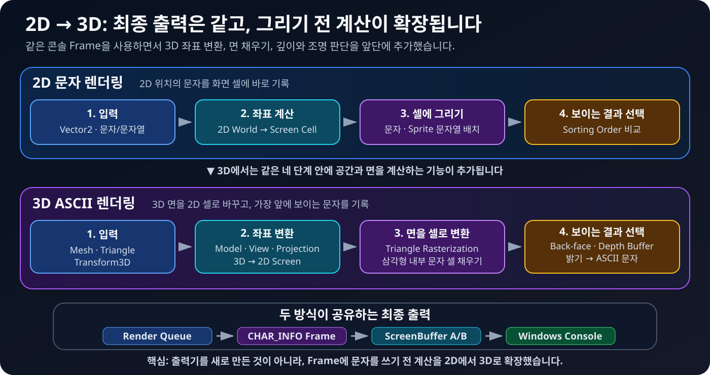
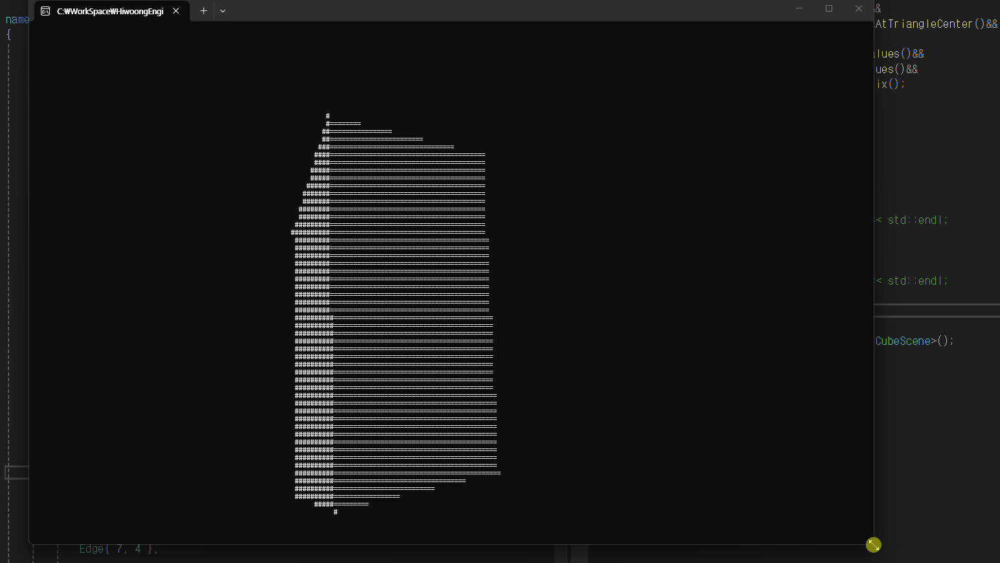

# HiwoongEngine

HiwoongEngine은 OpenGL, DirectX 같은 그래픽 API나 외부 게임 프레임워크 없이 C++ 표준 라이브러리와 Windows 콘솔 API로 동작합니다.

| 영역 | 직접 구현한 내용 |
|---|---|
| 게임 루프 | 입력 → 초기화 → 시작 → 업데이트 → 그리기의 프레임 순서 |
| Scene | 현재 Scene과 다음 Scene의 안전한 교체, GameObject 관리 |
| GameObject | 생명주기, 부모·자식 관계, Component 보관 |
| Component | `AddComponent<T>()`, `GetComponent<T>()`, 주인 객체 조회 |
| Transform | 2D 부모·자식 좌표와 3D 위치·회전·크기(`T * R * S`) 계산 |
| Input | 현재·이전 키 상태를 비교한 `GetKey`, `GetKeyDown`, `GetKeyUP` |
| Renderer | 문자·색상·좌표·겹침 순서 처리, 콘솔 더블 버퍼링 |
| 3D 수학 | `Vector3`, `Vector4`, `Matrix4x4`, 내적·외적, Model·View·Projection |
| Software Rasterizer | Mesh·Triangle, 뒷면 제거, 삼각형 채우기, 깊이 버퍼, ASCII 조명 |
| Type System | Component 검색에 사용하는 간단한 자체 RTTI와 상속 타입 확인 |

---

## 1. 엔진의 소유 구조

`Engine`은 전체 프로그램을 운영하고 `Scene`은 현재 무대, `GameObject`는 무대 위 대상, `Component`는 대상에 붙이는 기능 부품입니다.

```text
Engine
  ├─ Input
  ├─ Renderer
  └─ Scene
      └─ GameObject
          └─ Component
```

- `Engine`은 `Input`과 `Renderer`를 하나씩 소유합니다.
- `Scene`은 자신에게 존재하는 여러 `GameObject`를 소유합니다.
- `GameObject`는 기본 `TransformComponent`와 추가 Component들을 소유합니다.
- 자식이 부모를 조회할 때는 `weak_ptr`를 사용해 순환 소유를 막습니다.

즉, **위에서 아래로 수명을 책임지고 아래에서는 필요한 부모를 약하게 조회하는 구조**입니다.

---

## 2. 한 프레임의 동작

게임은 아래 순서를 빠르게 반복합니다.


1. 키보드의 현재 상태를 읽습니다.
2. 새 Scene이라면 `SceneInitialize()`를 실행합니다.
3. 새 GameObject와 Component의 `Start()`를 한 번 실행합니다.
4. `Update()`에서 위치와 게임 규칙을 계산합니다.
5. `Draw()`에서 이번 프레임의 그리기 명령을 수집하고 출력합니다.
6. 요청된 다음 Scene이 있다면 현재 Scene과 교체합니다.
7. 예약된 GameObject·Component의 추가와 삭제를 반영합니다.

생성과 삭제를 즉시 처리하지 않고 프레임 끝에 반영하는 이유는, 목록을 순회하는 도중 컨테이너가 바뀌어 반복자가 무효화되는 문제를 피하기 위해서입니다.

---

## 3. 컴포넌트 기반 구조

하나의 거대한 상속 계층에 모든 기능을 넣지 않고, 필요한 기능을 Component로 붙입니다.


모든 `GameObject`에는 `TransformComponent`가 기본으로 만들어집니다. 화면에 보여야 한다면 `SpriteRendererComponent`, 입력을 받아야 한다면 사용자 입력 Component를 추가하는 식입니다.

```cpp
auto renderer = AddComponent<SpriteRendererComponent>();
auto input = AddComponent<PlayerInputComponent>();
```

`GameObject`는 `Start()`, `Update()`, `Draw()`를 자신에게 붙은 Component에 전달합니다. 그래서 기능은 분리되어 있지만 하나의 객체처럼 같은 생명주기로 움직입니다.

### 부모·자식 Transform

GameObject끼리 부모·자식 관계를 맺으면 자식은 자신의 로컬 좌표에 부모의 월드 좌표를 더합니다.

```text
자식 월드 좌표 = 부모 월드 좌표 + 자식 로컬 좌표
```

부모 하나를 움직였을 때 여러 자식이 함께 이동하는 복합 객체를 만들 수 있습니다.

<details>
<summary><strong>GetComponent&lt;T&gt;는 타입을 어떻게 찾나요?</strong></summary>

`HiwoongObject`에 간단한 런타임 타입 확인 기능을 구현했습니다. 타입마다 프로세스 안에서 구분되는 ID를 만들고 부모 타입을 연결해, 정확히 같은 타입뿐 아니라 상속 관계도 확인합니다. 이 ID는 저장 파일용 영구 ID가 아니라 실행 중 타입 비교용입니다.

관련 코드: `HiwoongEngine/HiwoongEngine/Core/HiwoongObject.h`

</details>

---

## 4. 문자가 화면에 그려지는 과정

`SpriteRendererComponent`가 바로 콘솔을 수정하지는 않습니다. Renderer에 명령을 제출하고, 하나의 완성된 Frame을 만든 뒤 화면 버퍼에 기록합니다.


1. `SpriteRendererComponent`가 문자열, 월드 좌표, 색상, `sortingOrder`를 제출합니다.
2. `Renderer`가 한 프레임의 `RenderCommand`를 모읍니다.
3. 각 화면 셀에서 기존 값과 `sortingOrder`를 비교해 앞에 보일 문자를 정합니다.
4. 2차원 좌표를 1차원 인덱스로 바꾸어 `CHAR_INFO` Frame을 작성합니다.
5. 두 개의 Win32 `ScreenBuffer`를 번갈아 활성화합니다.

한 버퍼를 화면에 보여 주는 동안 다른 버퍼에 다음 프레임을 준비하기 때문에 콘솔의 깜빡임을 줄일 수 있습니다. Scene 크기가 바뀌면 Renderer와 두 ScreenBuffer, Frame도 새 크기에 맞게 다시 구성됩니다.

---

## 5. 입력과 Scene 전환

### 입력

`Input`은 256개 가상 키의 현재 프레임과 이전 프레임 상태를 함께 저장합니다.

| 함수 | 의미 |
|---|---|
| `GetKey(key)` | 지금 키가 눌려 있는가? |
| `GetKeyDown(key)` | 이번 프레임에 처음 눌렸는가? |
| `GetKeyUP(key)` | 이번 프레임에 놓였는가? |

### Scene 전환

게임 도중 새 Scene을 요청하면 즉시 현재 Scene을 파괴하지 않습니다. `nextScene`에 보관했다가 프레임의 정해진 전환 지점에서 교체합니다. 덕분에 `Update()` 도중 객체와 Scene의 수명이 갑자기 끝나는 상황을 피합니다.

---

## 6. 2D 엔진 적용 사례: 콘솔 테트리스

위의 2D 엔진 구조가 실제 게임을 운영할 수 있는지 확인하기 위해 콘솔 테트리스를 만들었습니다.

<table>
  <tr>
    <td align="center"><br><sub>이동 · 회전 · 다음 블록 UI</sub></td>
    <td align="center"><br><sub>보드 점유 검사와 GameOver 전환</sub></td>
    <td align="center"><br><sub>상태 유지와 레벨별 낙하 속도</sub></td>
  </tr>
</table>


### 테트리스는 어떤 논리로 만들었나요?

1. `SpawnManager`가 다음 조각 종류를 예약하고 7가지 `TetrisModule` 중 하나를 생성합니다.
2. 하나의 `TetrisModule`은 자식 `Block` 네 개를 소유하며, 각 Block은 자신의 로컬 좌표에 그려집니다.
3. 이동과 회전 전에 네 Block의 다음 월드 좌표가 비어 있는지 `TetrisBoard`에 확인합니다.
4. 더 내려갈 수 없으면 Block을 보드 셀에 고정하고 완성된 줄을 찾습니다.
5. 줄을 지운 뒤 위쪽 Block을 아래로 이동하고 점수와 레벨 상태를 갱신합니다.
6. 공간이 있으면 다음 조각을 만들고, 스폰 위치가 막혀 있으면 GameOver Scene으로 전환합니다.

보드는 `(x, y)`를 `y * width + x`로 바꾼 1차원 배열을 사용합니다. `TetrisGameState`는 Scene이 교체되어도 유지해야 하는 점수, 레벨, 다음 조각 정보를 보관합니다.

<details>
<summary><strong>조작 방법</strong></summary>

| 키 | 동작 |
|---|---|
| `←` / `→` | 좌우 이동 |
| `↓` | 한 칸 빠르게 내리기 |
| `↑` | 시계 방향 회전 |
| `Space` | 즉시 낙하하고 고정 |
| `Esc` | 종료 |
| GameOver에서 `R` | 게임 Scene으로 다시 진입 |

</details>

---

## 7. 2D 엔진을 3D ASCII 렌더러로 확장

테트리스로 Scene, Component, 입력, 2D 문자 렌더링을 검증한 뒤, 같은 엔진 위에 3D 수학과 소프트웨어 래스터라이저를 추가했습니다. OpenGL·DirectX에 정점 계산을 넘기지 않고, CPU가 3D 좌표를 콘솔의 문자 셀로 바꾸는 전 과정을 직접 처리합니다.



### 기존 구조에서 무엇을 재사용했나요?

| 그대로 사용한 기반 | 3D를 위해 추가한 기능 |
|---|---|
| Scene → GameObject → Component 생명주기 | `Transform3DComponent`의 위치·회전·크기 |
| 한 프레임의 그리기 명령을 모으는 Renderer | `Vector3`, `Vector4`, `Matrix4x4` 연산 |
| 2D 좌표를 문자 셀에 쓰는 Frame | Vertex·Edge·Triangle로 구성한 Mesh |
| 깔끔한 출력을 위한 두 개의 ScreenBuffer | 원근 투영, 뒷면 제거, 삼각형 래스터화 |
| 문자 겹침을 해결하는 셀 단위 판정 | 셀마다 가까운 면을 고르는 Depth Buffer |

즉, 엔진의 소유 구조와 프레임 흐름은 바꾸지 않고 **Renderer가 받아들일 수 있는 좌표와 가림 판정을 3D까지 확장**했습니다.

### 3D 점 하나가 ASCII 문자가 되는 순서

1. Mesh의 로컬 정점에 `Transform3DComponent`의 Model 행렬을 적용합니다.
2. `LookAt` View 행렬로 카메라를 기준으로 좌표를 바꿉니다.
3. Perspective 행렬과 원근 나누기로 멀리 있는 물체를 작게 만듭니다.
4. 3D 좌표를 콘솔의 2D 셀 좌표로 변환합니다.
5. 화면에서 뒤를 보는 삼각형은 Back-face Culling으로 건너뜁니다.
6. 남은 삼각형 내부를 채우고, 바리센트릭 가중치로 각 셀의 깊이를 계산합니다.
7. Depth Buffer로 가까운 면만 남기고, 법선과 빛 방향에 따라 ` .:-=+*#%@`를 선택합니다.

### 3D Transform도 Component로 분리

`Transform3DComponent` 하나가 Model 행렬을 만들기 때문에, Cube는 어떻게 이동·회전·확대해야 하는지 알 필요가 없습니다.

```cpp
Instantiate<CubeObject>(
    Vector3(0, 0, 5),          // Position
    Vector3(0.4f, 0.6f, 0),   // Rotation
    Vector3(1, 1, 1)           // Scale
);
```

### 결과: CPU로 그린 회전하는 ASCII 큐브

<p align="center">
  
</p>
<p align="center"><sub>Model·View·Projection, 삼각형 래스터화, Depth Buffer, 법선 기반 ASCII 조명을 적용한 결과</sub></p>

매 프레임 8개의 정점과 12개의 삼각형을 변환하고, 화면에 보이는 픽셀을 다시 채우며 회전합니다.

---

