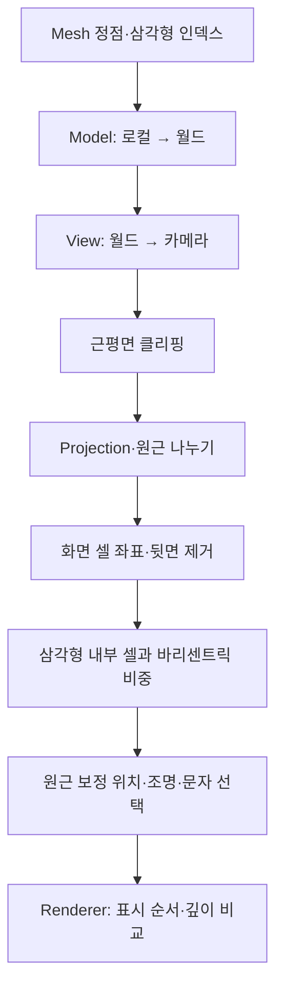

# HiwoongEngine

**C++로 게임의 구조와 렌더링 과정을 직접 구현한 2D·3D ASCII 게임 엔진입니다.**

Scene, GameObject, Component로 게임을 구성하고, CPU에서 계산한 3D 장면을 문자와 색상으로 표현합니다. 같은 엔진을 사용한 아스키 둠, 아스키 큐브, 아스키 테트리스를 통해 입력부터 화면 출력까지의 동작을 확인할 수 있습니다.

<br>
</br>


## 엔진으로 만든 작품

### [1. 아스키 둠 · ASCII Doom](AsciiDoom/README.md) (~진행중)

3D 맵 위에서 이동하며 조명을 비추고, 일시정지 메뉴와 체력·탄약 UI를 사용하는 개발 중인 1인칭 데모입니다.

<p align="center">
  <a href="AsciiDoom/README.md"></a><br>
</p>

### [2. 아스키 큐브 · ASCII Cube](AsciiCube/README.md)

회전하는 큐브를 통해 좌표 변환, 삼각형 채우기, 깊이 판정과 법선 기반 조명을 확인하는 3D 렌더링 데모입니다.

https://github.com/user-attachments/assets/639897e7-3dc8-43dd-8a19-020b15c6207a

### [3. 아스키 테트리스 · ASCII Tetris](AsciiTetris/README.md)

블록 이동·회전·낙하, 줄 제거, 점수와 레벨을 구현해 엔진의 2D 객체 구조와 씬 전환을 적용한 게임입니다.

<table>
  <tr>
    <td align="center"><a href="AsciiTetris/README.md"></a><br><sub>플레이</sub></td>
    <td align="center"><a href="AsciiTetris/README.md"></a><br><sub>게임 오버</sub></td>
    <td align="center"><a href="AsciiTetris/README.md"></a><br><sub>레벨업</sub></td>
  </tr>
</table>

---

## 엔진 소개

HiwoongEngine은 게임이 한 프레임을 만드는 과정을 이해하고 구현하기 위한 프로젝트입니다. 테트리스에 필요한 2D 기반을 만든 뒤, 벡터·행렬 연산과 소프트웨어 래스터화를 추가해 3D ASCII 장면으로 확장했습니다.

핵심 구조는 **게임 규칙, 객체에 붙는 기능, 렌더링 계산, 실제 화면 출력의 책임을 나누는 것**입니다. 세 작품은 하나의 저장소와 솔루션에서 공통 엔진 DLL을 사용합니다.

| 영역 | 구현 내용 | 주요 코드 |
|---|---|---|
| 실행 흐름 | 프레임 시간 계산, 입력·갱신·그리기, 예약된 씬 전환 | [Engine](HiwoongEngine/src/Engine/Engine.cpp) |
| 객체 구성 | Scene의 객체 관리, Component 추가·조회와 생명주기 | [Scene](HiwoongEngine/src/Scene/Scene.h), [GameObject](HiwoongEngine/src/GameObject/GameObject.h) |
| 좌표와 수학 | 위치·회전·크기, 부모 위치 상속, 벡터·행렬 연산 | [TransformComponent](HiwoongEngine/src/Component/TransformComponent.cpp), [Math](HiwoongEngine/src/Math) |
| 2D 렌더링 | 문자열 스프라이트, 공백 투명 처리, 셀별 표시 순서 | [SpriteRendererComponent](HiwoongEngine/src/Component/SpriteRendererComponent.cpp) |
| 3D 렌더링 | 원근 투영, 근평면 클리핑, 뒷면 제거, 삼각형 채우기·깊이 판정 | [MeshRenderer](HiwoongEngine/src/Render/MeshRenderer.cpp), [SoftwareRasterizer](HiwoongEngine/src/Render/SoftwareRasterizer.cpp) |
| 조명 | 기본 밝기, 방향광, 거리·각도·표면 방향을 반영한 스포트라이트 | [RenderView](HiwoongEngine/src/Render/RenderView.h), [SpotLight](HiwoongEngine/src/Render/SpotLight.h) |
| 입력·이동 검사 | 키 상태 변화, 마우스 이동량·잠금, 이동 예정 위치의 AABB 검사 | [Input](HiwoongEngine/src/Core/Input.cpp), [CollisionSystem](HiwoongEngine/src/Physics/CollisionSystem.cpp) |

기술 구성은 **C++17 · Windows API · Win32 콘솔 · GDI**입니다. 정점 변환과 삼각형 래스터화는 CPU에서 수행하고, 최종 결과는 문자 셀 단위로 출력합니다.

## 동작 원리

### 1. Scene → GameObject → Component


`Input`은 엔진이 관리하는 별도 객체입니다. 테트리스의 `PlayerInputComponent`는 이 객체에서 키 상태를 읽어 이동과 회전을 처리합니다.

```text
Engine
├─ Input                         입력 상태와 마우스 이동량
├─ Renderer                      그리기 명령과 완성된 프레임
│  └─ IRenderOutput              콘솔 또는 Win32 창으로 출력
└─ Scene                         현재 장면의 객체와 생명주기 관리
   └─ GameObject
      ├─ TransformComponent      기본 위치·회전·크기
      └─ 추가 Component          렌더링, 입력 등 객체별 기능
```

`GameObject`에는 `TransformComponent`가 기본으로 생성됩니다. 필요한 기능은 `AddComponent<T>()`로 붙이고 `GetComponent<T>()`로 조회합니다. Component도 소유 GameObject를 통해 다른 Component에 접근할 수 있습니다.

Scene이 GameObject를, GameObject가 자신의 Component를 보관합니다. 소유 Scene이나 GameObject, 부모·자식 객체를 다시 조회하는 관계에는 `weak_ptr`를 사용합니다. 객체의 수명 관리와 객체 사이의 연결을 구분하기 위한 구조입니다.

현재 부모·자식 Transform은 **위치의 합성**을 지원합니다.

```text
자식 월드 위치 = 부모 월드 위치 + 자식 로컬 위치
Model 행렬 = 이동 × 회전 × 크기
```

Model 행렬의 이동에는 월드 위치를 사용하고 회전·크기에는 해당 Transform의 값을 사용합니다. 부모 회전과 크기까지 누적하는 계층형 행렬 계산은 현재 구현 범위에 포함되지 않습니다.

Component 검색에는 [HiwoongObject](HiwoongEngine/src/Core/HiwoongObject.h)의 타입 ID와 부모 타입 확인을 사용합니다. 이 ID는 실행 중 타입 구분을 위한 값입니다.

### 2. 한 프레임의 실행 순서


`Engine::Run()`은 설정된 프레임 간격이 지나면 입력을 읽고, 실제 경과 시간인 `deltaTime`을 `Update()`에 전달합니다. 초기화와 `Start()`는 상태를 확인해 필요한 대상에 한 번 실행합니다.

GameObject의 추가·삭제와 Component의 추가는 예약 목록을 통해 처리합니다. 순회 중인 목록을 즉시 바꾸지 않고 프레임 끝의 정해진 지점에서 반영합니다.

씬 전환도 `nextScene`에 예약합니다. 일시정지할 때는 현재 게임 씬을 `pausedScene`으로 보관하고 마지막 프레임의 문자·색상을 캡처합니다. 메뉴가 실행되는 동안 게임 씬의 상태를 유지하며, 재개 시 보관한 씬으로 돌아갑니다.

관련 코드: [Engine.cpp](HiwoongEngine/src/Engine/Engine.cpp), [Scene.cpp](HiwoongEngine/src/Scene/Scene.cpp)

### 3. 2D와 3D 결과를 하나의 문자 프레임으로 합성


`SpriteRendererComponent`는 문자열을 줄 단위로 읽고, 공백을 제외한 구간을 Renderer에 제출합니다. 각 문자 위치에는 GameObject의 월드 위치를 반영합니다. 이 방식으로 스프라이트 주변 여백이 뒤쪽 장면을 가리지 않게 합니다.

`Renderer`는 문자열, 선, 3D 셀 명령을 수집한 뒤 다음 세 배열을 사용해 프레임을 만듭니다.

| 셀별 데이터 | 역할 |
|---|---|
| `CHAR_INFO` | 표시할 문자와 전경·배경 색상 속성 |
| `sortingOrder` | 겹친 2D 요소와 3D 장면 사이의 표시 우선순위 |
| Depth Buffer | 같은 표시 순서의 3D 셀 중 가까운 표면 선택 |

화면 좌표 `(x, y)`는 `y * width + x`로 배열 위치에 대응합니다. `sortingOrder`가 높은 요소가 우선하고, 같은 순서의 3D 셀끼리는 더 작은 깊이 값을 남깁니다. 따라서 3D 장면과 문자로 만든 UI를 하나의 프레임에 합성할 수 있습니다.

관련 코드: [Renderer.cpp](HiwoongEngine/src/Render/Renderer.cpp)

### 4. 3D 삼각형이 ASCII 문자가 되는 과정


공용 3D 렌더링 경로인 `MeshRenderer`는 다음 순서로 장면을 계산합니다.



- **좌표 변환:** Model·View·Projection 행렬로 물체를 카메라 관점의 화면 좌표로 옮깁니다. 문자 한 칸의 가로·세로 비율도 화면 종횡비 계산에 반영합니다.
- **근평면 클리핑:** 카메라 바로 앞의 경계를 가로지르는 삼각형은 교점을 구해 잘라냅니다. 잘린 결과가 사각형이면 다시 삼각형으로 나눕니다.
- **삼각형 채우기:** 화면상 뒷면을 제외하고 경계 안의 셀을 구합니다. 바리센트릭 좌표는 각 셀이 세 정점의 값을 얼마나 반영하는지 나타내는 비중입니다.
- **원근 보정:** 화면 비중에 카메라 깊이의 역수 `1/z`를 반영해 셀에 해당하는 3D 위치를 복원합니다. 조명은 이 위치에서 계산하고, 깊이 버퍼에는 화면 비중으로 보간한 투영 후 깊이를 사용합니다.

밝기는 기본 밝기와 방향광, 스포트라이트의 영향을 합쳐 계산합니다. 스포트라이트는 **광원과의 거리, 빛의 중심 방향과의 각도, 표면 법선 방향**을 각각 반영합니다. 계산한 밝기를 문자 배열에 대응시켜 `' '`, `.`, `:`, `*`, `#`, `@`처럼 밀도가 다른 문자로 표현합니다.

관련 코드: [MeshRenderer.cpp](HiwoongEngine/src/Render/MeshRenderer.cpp), [SoftwareRasterizer.cpp](HiwoongEngine/src/Render/SoftwareRasterizer.cpp), [Matrix4x4.cpp](HiwoongEngine/src/Math/Matrix4x4.cpp)

### 5. 입력과 이동 가능 여부

키보드는 현재·이전 프레임 상태를 비교해 누르고 있는 상태인 `GetKey`, 처음 누른 순간인 `GetKeyDown`, 놓은 순간인 `GetKeyUP`을 구분합니다.

마우스는 프레임마다 이동량을 초기화한 뒤 새 이동량을 읽습니다. 잠금 대상 창을 지정할 수 있고, 잠금 중에는 커서를 창 안으로 제한한 뒤 중앙으로 되돌립니다. `MouseLookComponent`는 수평 이동량을 회전에 반영합니다.

3D 이동은 이동 예정 위치에서 `BoxCollider3DComponent`끼리 AABB 검사를 수행합니다. AABB는 각 축에 나란한 박스이며, X·Y·Z 중 한 축이라도 범위가 떨어져 있으면 겹치지 않는 것으로 판단합니다. 현재 게임에서 사용하는 경로는 `Scene::CanMoveTo()`를 통한 이동 가능 여부 조회입니다.

관련 코드: [Input.cpp](HiwoongEngine/src/Core/Input.cpp), [MouseLookComponent.cpp](HiwoongEngine/src/Component/MouseLookComponent.cpp), [BoxCollider3DComponent.cpp](HiwoongEngine/src/Component/BoxCollider3DComponent.cpp)

