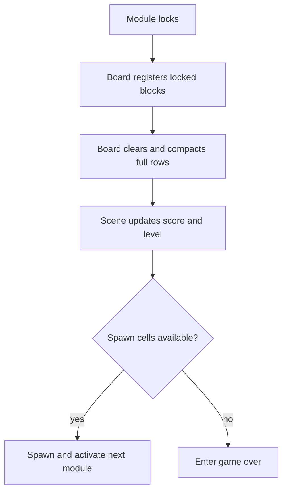

# feat: Finish and publish the Tetris game

## Summary

Complete the playable Tetris loop today, stabilize it through focused logic and manual tests, document the project, and publish the finished state to the existing GitHub repository.

## Problem Frame

Movement, rotation, hard drop, locking, and spawning are implemented. The game is not complete because locked rows are never removed, progression and game-over state are incomplete, and the repository lacks a README and clean publish checkpoint.

## Requirements

**Core game loop**

- R1. A completely occupied playable row is removed from both board data and rendered blocks.
- R2. Blocks above a removed row move down by the correct number of cleared rows.
- R3. Clearing rows awards `100/300/500/800 × current level` points, and every 10 cleared lines advances the level and affects future falling speed.
- R4. A new module that cannot occupy its spawn cells ends the game instead of overlapping existing blocks.

**Quality and publication**

- R5. Move, rotate, soft drop, hard drop, lock, clear, and repeated spawning work together without assertions or visible data/render desynchronization.
- R6. The repository documents build, run, controls, architecture, and current feature scope.
- R7. Generated Visual Studio state is absent from the final tracked repository tree, and the verified result is pushed to `origin/main`.

## Key Technical Decisions

- **Board remains authoritative:** Extend `TetrisBoard` with distinct permanent-wall and locked-block cell states; locked cells identify their rendered `Block` so clearing never removes map walls.
- **Clear after lock:** Resolve full rows immediately after a module locks and before the next playable module becomes active, preventing the next module from observing stale cells.
- **Scene owns session state:** Keep score, cleared lines, level, and game-over state in `TestScene`; newly spawned modules receive the existing clamped drop-interval calculation from the scene.
- **MVP scope:** Finish the current controls and play loop without hold, ghost piece, next preview, advanced wall kicks, sound, or full guideline scoring.

## High-Level Technical Design

## Implementation Units

### U1. Stabilize the completed movement loop

- **Goal:** Confirm the current rotation, soft drop, hard drop, locking callback, and spawn lifecycle share the same board coordinates.
- **Requirements:** R5
- **Dependencies:** None
- **Files:** `HiwoongEngine/TetrisProject/Interface/TetrisModule.cpp`, `HiwoongEngine/TetrisProject/GameObject/Player/PlayerInputComponent.cpp`, `HiwoongEngine/TetrisProject/GameObject/SpawnManager/SpawnManager.cpp`, `docs/testing/tetris-manual-test-matrix.md`
- **Approach:** Characterize rotation and movement at walls, floor, and existing blocks before changing row storage. Ensure locked modules no longer mutate and lock notifications occur once.
- **Patterns to follow:** Existing `CanMove`, `TryMove`, `TryRotate`, `Drop`, and lock callback flow.
- **Test scenarios (manual):**
  - Rotate each rotatable shape in open space four times and recover its initial local coordinates.
  - Reject moves and rotations that overlap a wall or occupied cell without changing logical or rendered positions.
  - Hard-drop a module, lock once, and spawn exactly one successor.
- **Verification:** All controls operate on one active module and logical positions match child block positions.
- **Estimate:** 45-60 minutes.

### U2. Clear completed rows and collapse blocks

- **Goal:** Add the missing row-clear operation to the board and keep visual blocks synchronized.
- **Requirements:** R1, R2, R5
- **Dependencies:** U1
- **Files:** `HiwoongEngine/TetrisProject/GameObject/BackGround/TetrisBoard.h`, `HiwoongEngine/TetrisProject/GameObject/BackGround/TetrisBoard.cpp`, `HiwoongEngine/TetrisProject/Interface/TetrisModule.cpp`, `HiwoongEngine/TetrisProject/Scene/TestScene.cpp`, `docs/testing/tetris-manual-test-matrix.md`
- **Approach:** Register walls and locked blocks as different cell kinds, find complete playable rows using locked cells, remove their block objects, then compact surviving locked cells and rendered objects downward in one pass.
- **Patterns to follow:** Existing board bounds checks and GameObject deferred destruction lifecycle.
- **Test scenarios (manual):**
  - Clear one full row while preserving an incomplete neighboring row.
  - Clear two and four rows at once and move every surviving block by the correct distance.
  - Clear two non-adjacent rows and move each survivor by exactly the number of cleared rows below it.
  - Never clear permanent wall cells or move them during compaction.
- **Verification:** Repeated line clears leave no invisible occupied cells, floating rendered blocks, or wall changes.
- **Estimate:** 2 hours 30 minutes-3 hours.

### U3. Complete session progression and game over

- **Goal:** Turn the board mechanics into a complete start-to-game-over session.
- **Requirements:** R3, R4, R5
- **Dependencies:** U2
- **Files:** `HiwoongEngine/TetrisProject/Scene/TestScene.h`, `HiwoongEngine/TetrisProject/Scene/TestScene.cpp`, `HiwoongEngine/TetrisProject/Interface/TetrisModule.h`, `HiwoongEngine/TetrisProject/Interface/TetrisModule.cpp`, `HiwoongEngine/TetrisProject/GameObject/SpawnManager/SpawnManager.h`, `HiwoongEngine/TetrisProject/GameObject/SpawnManager/SpawnManager.cpp`, `HiwoongEngine/TetrisProject/GameObject/UI/GameStatusUI.h`, `HiwoongEngine/TetrisProject/GameObject/UI/GameStatusUI.cpp`, `HiwoongEngine/Assets/Stages/map.txt`, `docs/testing/tetris-manual-test-matrix.md`
- **Approach:** Return cleared-row count to the scene, apply the fixed MVP score table, advance every 10 lines, and assign the scene interval to future modules. Stop spawning/input when spawn cells are occupied and render score, level, and game-over text in a right-side status area.
- **Patterns to follow:** Existing scene ownership, drop-interval calculation, and renderer component flow.
- **Test scenarios (manual):**
  - One, two, three, and four simultaneous rows award 100, 300, 500, and 800 points multiplied by the current level.
  - Reaching 10 cleared lines advances one level and applies the existing `max(0.1, 1.0 - (level - 1) × 0.1)` interval to the next spawned module.
  - Occupied spawn cells enter game-over once and prevent additional module spawning.
  - A row-completing lock finishes clear and compaction before the successor is validated and activated.
- **Verification:** A session can progress through multiple clears and terminates predictably when the stack reaches the spawn area.
- **Estimate:** 2 hours-2 hours 30 minutes.

### U4. Release verification and GitHub publication

- **Goal:** Produce a reproducible, clean GitHub checkpoint of the completed game.
- **Requirements:** R5, R6, R7
- **Dependencies:** U1, U2, U3
- **Files:** `README.md`, `.gitignore`, `docs/testing/tetris-manual-test-matrix.md`, `HiwoongEngine/HiwoongEngine.sln`, `HiwoongEngine/Assets/Stages/map.txt`
- **Approach:** Confirm GitHub access before implementation, then run a clean Debug x64 build and the play matrix. Document controls and architecture, remove tracked `.vs` and `.vcxproj.user` state without deleting local IDE files, review the final diff, commit cohesive changes, and push the verified checkpoint.
- **Test scenarios:**
  - Start from a clean build and play through movement, rotation, soft drop, hard drop, line clear, level change, and game over.
  - Launch using the README instructions from the expected working directory and load `map.txt` successfully.
  - Confirm the README contains build, run, controls, architecture, and current-scope sections.
  - Confirm the final repository contains source and assets but no generated Visual Studio database or user-state files.
- **Verification:** The solution builds, the manual matrix passes, the working tree is clean, and `origin/main` contains the final commit.
- **Estimate:** 1 hour-1 hour 30 minutes.

## Schedule

- **Hour 0-0.25:** Confirm GitHub authentication, remote access, and direct push to `main`.
- **Hour 0.25-1:** U1 movement and rotation regression check.
- **Hour 1-4:** U2 board row clearing and visual compaction.
- **Hour 4-6.5:** U3 score, level, status UI, and game over.
- **Hour 6.5-8:** U4 full play test, README, repository cleanup, commit, and push.
- **Buffer:** Up to 1 hour for row-compaction or renderer-lifecycle defects.

Expected total: **7-9 hours**. If row clearing exceeds three hours, keep the must-have path—clear, compact, game over, verification, README, and push—and reduce status UI polish before cutting correctness work.

## Scope Boundaries

### Deferred to Follow-Up Work

- Hold piece, ghost piece, next-piece preview, full SRS wall kicks, sound, animation, and polished menus.
- In-game restart; restarting the executable begins a new session for today's release.
- Automated C++ test-project infrastructure; today's release gate is the committed manual test matrix.
- Refactoring `TestScene` and `TetrisModule` into reusable engine-level gameplay abstractions.

## Risks & Dependencies

- `TetrisBoard` currently stores only booleans, so visual row removal needs an explicit block-reference strategy.
- GameObject destruction is deferred; row compaction must not leave a block rendered for an extra frame in an invalid cell.
- `.vs` files are ignored now but already tracked, so repository cleanup must remove them from tracking without deleting local IDE state.
